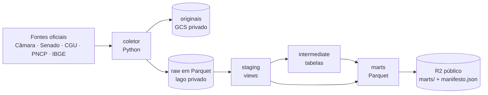
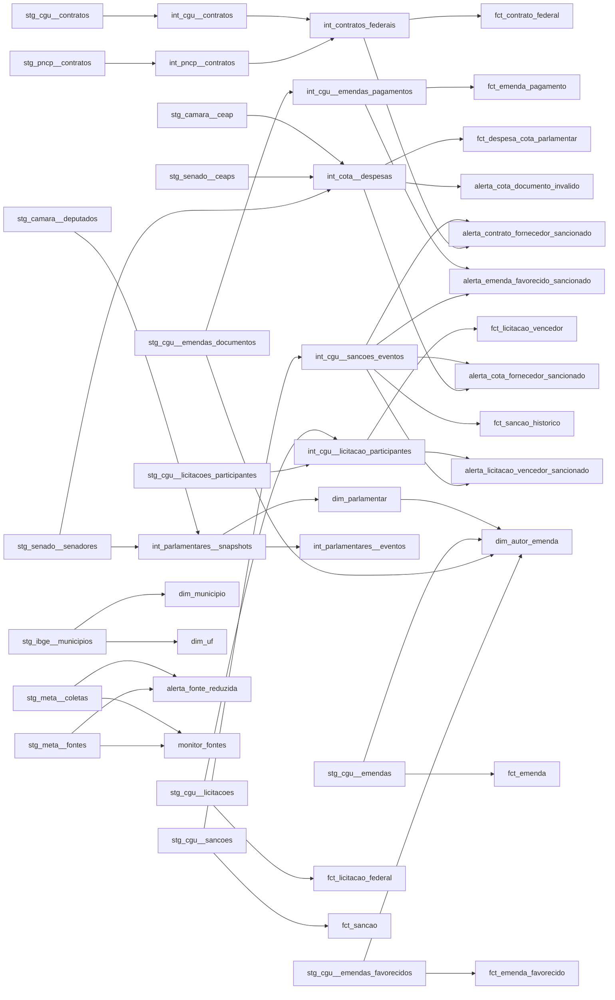

# Modelos de dados

Documentação dos dados publicados pelo projeto **eleitorado**: de onde vêm, como são transformados e o que significa cada tabela e coluna. Serve a quem consome os arquivos públicos (análise, jornalismo, a futura aplicação web) e a quem contribui com o projeto.

> Volumes de produção do `manifesto.json` publicado em 2026-10-06. Colunas e tipos extraídos dos próprios arquivos Parquet e do catálogo do dbt. Algumas séries ainda estão em carga histórica e crescem a cada dia.

## Sumário

1. [Visão geral](#visão-geral)
2. [Como acessar os dados](#como-acessar-os-dados)
3. [Convenções](#convenções)
4. [Fontes](#fontes)
5. [Linhagem](#linhagem)
6. [Marts publicados](#marts-publicados)
   - Dimensões: [`dim_uf`](#dim_uf), [`dim_municipio`](#dim_municipio), [`dim_parlamentar`](#dim_parlamentar), [`dim_autor_emenda`](#dim_autor_emenda)
   - Fatos: [`fct_despesa_cota_parlamentar`](#fct_despesa_cota_parlamentar), [`fct_emenda`](#fct_emenda), [`fct_emenda_favorecido`](#fct_emenda_favorecido), [`fct_emenda_pagamento`](#fct_emenda_pagamento), [`fct_contrato_federal`](#fct_contrato_federal), [`fct_licitacao_federal`](#fct_licitacao_federal), [`fct_licitacao_vencedor`](#fct_licitacao_vencedor), [`fct_sancao`](#fct_sancao), [`fct_sancao_historico`](#fct_sancao_historico)
   - Alertas: [`alerta_cota_fornecedor_sancionado`](#alerta_cota_fornecedor_sancionado), [`alerta_cota_documento_invalido`](#alerta_cota_documento_invalido), [`alerta_emenda_favorecido_sancionado`](#alerta_emenda_favorecido_sancionado), [`alerta_contrato_fornecedor_sancionado`](#alerta_contrato_fornecedor_sancionado), [`alerta_licitacao_vencedor_sancionado`](#alerta_licitacao_vencedor_sancionado), [`alerta_fonte_reduzida`](#alerta_fonte_reduzida)
   - Monitoramento: [`monitor_fontes`](#monitor_fontes)
7. [Camada intermediate](#camada-intermediate)
8. [Camada staging](#camada-staging)
9. [Qualidade e testes](#qualidade-e-testes)
10. [Limitações conhecidas](#limitações-conhecidas)

## Visão geral

O projeto coleta dados abertos de fontes oficiais, guarda o original de cada coleta e transforma tudo em tabelas analíticas com o dbt sobre DuckDB. Só a camada final (marts), sem CPF completo, é publicada.



| Camada | Onde fica | Visibilidade | Conteúdo |
|---|---|---|---|
| originais | GCS (`originais/`) | privada | Arquivo exatamente como baixado, para sempre (classe Archive após 30 dias). |
| raw | lago Parquet (`raw/<órgão>/<recurso>/`) | privada | Uma linha por registro da fonte, texto como veio, + metadados da coleta. |
| staging | views no DuckDB | privada | Tipos convertidos, nomes padronizados, documentos normalizados. |
| intermediate | tabelas no DuckDB | privada | Regras de negócio, deduplicação, históricos; **contém documento completo** (usado nos cruzamentos). |
| marts | Parquet no R2 | **pública** | Dimensões, fatos, alertas e monitoramento; CPF sempre mascarado. |

O pipeline roda todo dia às 07:30 (Brasília) no GitHub Actions: coleta o que venceu, roda o dbt com todos os testes e só então publica.

## Como acessar os dados

Base pública: `https://pub-e140b10136c94c9eb7cdb0a31fe603f3.r2.dev/` (endereço provisório do Cloudflare R2; um domínio próprio vai substituí-lo).

- `manifesto.json` — lista de todos os arquivos publicados, com bytes, linhas e SHA-256, a data de geração e o commit que os gerou. É publicado por último: se o manifesto mudou, os arquivos já estão no lugar.
- `marts/<modelo>.parquet` — um arquivo por mart.
- `marts/<modelo>/<coluna>=<valor>/data_0.parquet` — marts grandes, particionados no estilo Hive.
- `linhagem/index.html` — documentação interativa do dbt (grafo de linhagem e SQL de cada modelo).

O R2 não lista diretórios, então leia o manifesto para descobrir os arquivos de um mart particionado.

**DuckDB (SQL):**

```sql
install httpfs; load httpfs;

-- mart sem partição: leitura direta
select cadastro, count(*) from read_parquet('https://pub-e140b10136c94c9eb7cdb0a31fe603f3.r2.dev/marts/fct_sancao.parquet') group by all;

-- mart particionado: os arquivos vêm do manifesto
set variable arquivos = (
    select list('https://pub-e140b10136c94c9eb7cdb0a31fe603f3.r2.dev/' || a.caminho)
    from (select unnest(arquivos) as a from read_json('https://pub-e140b10136c94c9eb7cdb0a31fe603f3.r2.dev/manifesto.json'))
    where a.caminho like 'marts/fct_despesa_cota_parlamentar/%'
);

select casa, ano, sum(valor_reembolsado) as reembolsado
from read_parquet(getvariable('arquivos'), hive_partitioning = true)
group by all order by all;
```

**Python (pandas):**

```python
import pandas as pd, requests
BASE = "https://pub-e140b10136c94c9eb7cdb0a31fe603f3.r2.dev"
manifesto = requests.get(f"{BASE}/manifesto.json").json()
urls = [f"{BASE}/{a['caminho']}" for a in manifesto["arquivos"]
        if a["caminho"].startswith("marts/fct_emenda_pagamento/")]
pagamentos = pd.concat(pd.read_parquet(u) for u in urls)
```

## Convenções

### Nomes

| Prefixo | Significado |
|---|---|
| `dim_` | Dimensão: cadastro de entidades (parlamentares, municípios...). |
| `fct_` | Fato: eventos ou registros (despesas, contratos, sanções...). |
| `alerta_` | Cruzamento que aponta um indício para investigar. |
| `monitor_` | Saúde do próprio pipeline. |
| `stg_<fonte>__<recurso>` / `int_<assunto>` | Camadas internas (não publicadas). |

Colunas em `snake_case` e português. Valores monetários em `DECIMAL(38,2)` (reais). Datas em `DATE`; momentos em `TIMESTAMP` UTC.

### Chaves

- Chaves com prefixo de origem evitam colisão entre fontes: `camara:<id>`, `senado:<id>`, `cgu:<UG>:<número>`, `pncp:<numeroControlePNCP>`, `CEIS:<código>`, `CNEP:<código>`.
- Fontes sem chave por linha (CEAP, emendas, licitações) usam o MD5 do conteúdo da linha mais a ocorrência entre linhas idênticas (`..._linha_id`). A chave é estável enquanto a fonte não mudar a linha.
- `alerta_id` é o MD5 de `regra|chaves de origem` e não muda entre execuções.
- `_coleta_id` em todo mart liga cada linha à coleta (e ao arquivo original) de onde veio.

### Documentos (CPF e CNPJ) e LGPD

Os marts da Receita (`dim_empresa`, `dim_estabelecimento` e os alertas da onda C1) também passam por `sem_dados_pessoais`: falha se o mart tiver coluna de endereço, contato ou sócio pessoa física.

- **CPF nunca é publicado completo.** Nos marts ele sai como `***.456.789-**` (só os 6 dígitos do meio). O mesmo vale para CPFs dentro de texto livre (nome de MEI, objeto, detalhamento), que são mascarados por expressão regular.
- CNPJ é dado de pessoa jurídica e sai completo. Desde 31/07/2026 o CNPJ pode ser **alfanumérico** (12 posições com dígitos ou letras + 2 dígitos verificadores); a validação já cobre os dois formatos.
- `*_cnpj_raiz`: as 8 primeiras posições do CNPJ, que identificam a empresa (matriz e filiais).
- `*_documento_valido`: tamanho e dígitos verificadores (módulo 11) conferidos.

**Tipos de documento** (`*_tipo_documento`):

| Valor | Significado |
|---|---|
| `CPF` | 11 dígitos (publicado mascarado). |
| `CNPJ` | 14 posições (numérico ou alfanumérico). |
| `CPF_MASCARADO` | A própria fonte já publica o CPF mascarado (Senado, emendas). |
| `SIGILOSO` | A fonte informa sigilo (código `-11` do Portal da Transparência). |
| `CODIGO_CAMARA` | Código interno da Câmara (`000000000000NN`): telefonia, Correios, fornecedor estrangeiro. |
| `INVALIDO` | Preenchido, mas sem o tamanho de CPF ou CNPJ. |
| nulo | Não informado. |

### Cruzamento com sanções (alertas)

Os alertas `*_sancionado` cruzam um documento (fornecedor, favorecido, vencedor) com **qualquer versão já vista** de cada sanção do CEIS/CNEP, e exigem que a data do fato (emissão, assinatura, pagamento, licitação) esteja dentro da vigência da sanção (`data_inicio` até `data_fim`, aberta quando nula).

- Pessoa física: CPF completo (o cruzamento acontece na camada privada).
- Pessoa jurídica: raiz do CNPJ. `tipo_correspondencia = 'cnpj'` quando o CNPJ é idêntico; `'cnpj_raiz'` quando a sanção é de outro estabelecimento da mesma empresa.
- Um alerta é um **indício**: a abrangência da sanção varia (pode valer só para o órgão sancionador) e o histórico de sanções começa na primeira coleta do projeto.

## Fontes

| Recurso | Descrição | Publicação | Competência | Cadência (recentes/antigas) |
|---|---|---|---|---|
| `camara.ceap` | Despesas da CEAP (Câmara) | por competência | ano, desde 2008 | diária / semanal |
| `camara.deputados` | Deputados da 53ª legislatura à atual | snapshot | data da coleta | semanal |
| `senado.ceaps` | Despesas da CEAPS (Senado) | por competência | ano, desde 2008 | diária / semanal |
| `senado.senadores` | Senadores da 53ª legislatura à atual | snapshot | data da coleta | semanal |
| `cgu.ceis` | Cadastro de Empresas Inidôneas e Suspensas | snapshot | data do arquivo | diária |
| `cgu.cnep` | Cadastro Nacional de Empresas Punidas | snapshot | data do arquivo | diária |
| `cgu.emendas` | Emendas parlamentares (emenda × localidade) | snapshot | data da coleta | semanal |
| `cgu.emendas_convenios` | Convênios ligados a emendas | snapshot | data da coleta | semanal |
| `cgu.emendas_favorecidos` | Favorecidos de emendas por mês | snapshot | data da coleta | semanal |
| `cgu.emendas_documentos` | Documentos de despesa de emendas | por competência | ano, desde 2014 | semanal / mensal |
| `cgu.contratos` | Contratos do Executivo federal | por competência | mês, desde 2013 | semanal / mensal |
| `cgu.licitacoes` | Licitações do Executivo federal | por competência | mês, 2013 a 2024-04 | mensal |
| `cgu.licitacoes_participantes` | Participantes de licitações | por competência | mês, 2013 a 2024-04 | mensal |
| `pncp.contratos` | Contratos do PNCP (todas as esferas) | por competência | dia, desde 2021 | semanal / anual |
| `pncp.contratos_atualizacao` | Contratos do PNCP atualizados nos últimos 7 dias | snapshot | data da coleta | diária |
| `ibge.municipios` | Municípios e hierarquia territorial | snapshot | data da coleta | mensal |
| `camara.deputados_detalhe` | Detalhe dos deputados (nome civil e CPF; só no lago privado) | snapshot | data da coleta | mensal |
| `rfb.empresas`, `rfb.estabelecimentos`, `rfb.socios`, `rfb.simples` | Base do CNPJ da Receita, recortada às raízes que aparecem nos dados | snapshot mensal (histórico mantido) | pasta `AAAA-MM` da Receita | semanal (coleta uma vez por competência) |
| `rfb.cnaes`, `rfb.municipios`, `rfb.naturezas`, `rfb.qualificacoes`, `rfb.motivos`, `rfb.paises` | Tabelas de apoio da Receita (código e descrição) | snapshot mensal | pasta `AAAA-MM` da Receita | semanal |

Órgãos: Câmara dos Deputados (`dadosabertos.camara.leg.br`, `www.camara.leg.br`), Senado Federal (`legis.senado.leg.br`, `adm.senado.gov.br`), Controladoria-Geral da União — Portal da Transparência (`portaldatransparencia.gov.br`), Portal Nacional de Contratações Públicas (`pncp.gov.br`) IBGE (`servicodados.ibge.gov.br`) e Receita Federal (`arquivos.receitafederal.gov.br`, compartilhamento WebDAV; a Receita bloqueia os IPs do GitHub Actions, então a coleta roda do computador do mantenedor, fora do pipeline diário). O catálogo completo, com URLs e condições de uso, está em `fontes/*.yaml`.

- **Snapshot**: a fonte publica o estado atual; cada coleta guarda uma fotografia (o raw mantém 60 dias; os históricos de sanções e parlamentares guardam os eventos para sempre).
- **Por competência**: a fonte publica um arquivo por ano, mês ou dia; competências recentes são recoletadas com mais frequência porque ainda mudam.

## Linhagem

Visão simplificada (staging → intermediate → marts). O grafo completo, com o SQL de cada modelo, está em `linhagem/index.html`.



## Marts publicados

| Mart | Grão | Linhas | Tamanho |
|---|---|---:|---:|
| [`dim_uf`](#dim_uf) | UF | 27 | 1,7 KB |
| [`dim_municipio`](#dim_municipio) | município | 5.571 | 85,3 KB |
| [`dim_parlamentar`](#dim_parlamentar) | parlamentar por casa (quem passou pelas duas casas tem duas linhas) | 2.495 | 52,1 KB |
| [`dim_autor_emenda`](#dim_autor_emenda) | autor (`autor_codigo` do Portal) | 1.573 | 21,6 KB |
| [`fct_despesa_cota_parlamentar`](#fct_despesa_cota_parlamentar) | linha de despesa como publicada | 4.431.699 | 220,3 MB |
| [`fct_emenda`](#fct_emenda) | linha publicada (emenda × localidade) | 94.627 | 4,5 MB |
| [`fct_emenda_favorecido`](#fct_emenda_favorecido) | emenda × favorecido × mês (linha publicada) | 826.056 | 37,3 MB |
| [`fct_emenda_pagamento`](#fct_emenda_pagamento) | documento de despesa (linha publicada) | 4.734.064 | 263,0 MB |
| [`fct_contrato_federal`](#fct_contrato_federal) | contrato | 204.216 | 18,3 MB |
| [`fct_licitacao_federal`](#fct_licitacao_federal) | licitação | 464.658 | 28,7 MB |
| [`fct_licitacao_vencedor`](#fct_licitacao_vencedor) | participante vencedor × item (linha publicada) | 1.080.232 | 49,4 MB |
| [`fct_sancao`](#fct_sancao) | sanção | 25.507 | 1,1 MB |
| [`fct_sancao_historico`](#fct_sancao_historico) | evento de sanção | 28.934 | 1,8 MB |
| [`alerta_cota_fornecedor_sancionado`](#alerta_cota_fornecedor_sancionado) | despesa × sanção | 388 | 30,0 KB |
| [`alerta_cota_documento_invalido`](#alerta_cota_documento_invalido) | despesa | 73 | 8,3 KB |
| [`alerta_emenda_favorecido_sancionado`](#alerta_emenda_favorecido_sancionado) | documento de despesa × sanção | 23.132 | 1,1 MB |
| [`alerta_contrato_fornecedor_sancionado`](#alerta_contrato_fornecedor_sancionado) | contrato × sanção | 6.996 | 550,5 KB |
| [`alerta_licitacao_vencedor_sancionado`](#alerta_licitacao_vencedor_sancionado) | participante vencedor × sanção | 1.353 | 83,4 KB |
| [`alerta_fonte_reduzida`](#alerta_fonte_reduzida) | carga | 14 | 3,5 KB |
| [`monitor_fontes`](#monitor_fontes) | recurso do coletor | 16 | 2,6 KB |

### Dimensões

#### dim_uf

**UFs.** Uma linha por unidade da federação, derivada dos municípios do IBGE.

- **Grão:** UF
- **Chave:** `uf_sigla` (também `uf_id`)
- **Fonte:** IBGE (API de Localidades)
- **Arquivo:** `marts/dim_uf.parquet`
- **Volume:** 27 linhas, 1,7 KB
- **Modelos de origem:** `stg_ibge__municipios`
- **Testes:** `not_null(uf_sigla)`, `sem_cpf_completo`, `unique(uf_sigla)`

| Coluna | Tipo | Descrição |
|---|---|---|
| `uf_id` | VARCHAR | Código IBGE da UF. |
| `uf_sigla` | VARCHAR | Sigla da UF. |
| `uf_nome` | VARCHAR | Nome da UF. |
| `regiao_sigla` | VARCHAR | Sigla da região (N, NE, CO, SE, S). |
| `regiao_nome` | VARCHAR | Nome da região (Norte, Nordeste...). |
| `_coleta_id` | VARCHAR | Coleta que trouxe a linha (rastreia até o arquivo original arquivado; ver `meta.coletas`). |

#### dim_municipio

**Municípios.** Municípios brasileiros com a hierarquia territorial do IBGE (micro e mesorregião, regiões imediata e intermediária).

- **Grão:** município
- **Chave:** `municipio_id` (código IBGE de 7 dígitos)
- **Fonte:** IBGE (API de Localidades)
- **Arquivo:** `marts/dim_municipio.parquet`
- **Volume:** 5.571 linhas, 85,3 KB
- **Modelos de origem:** `stg_ibge__municipios`
- **Testes:** `not_null(municipio_id)`, `not_null(uf_sigla)`, `relationships(uf_sigla)`, `sem_cpf_completo`, `unique(municipio_id)`

| Coluna | Tipo | Descrição |
|---|---|---|
| `municipio_id` | VARCHAR | Código IBGE do município (7 dígitos). |
| `municipio_nome` | VARCHAR | Nome do município. |
| `uf_sigla` | VARCHAR | Sigla da UF. |
| `microrregiao` | VARCHAR | Microrregião (IBGE). |
| `mesorregiao` | VARCHAR | Mesorregião (IBGE). |
| `regiao_imediata` | VARCHAR | Região geográfica imediata (IBGE). |
| `regiao_intermediaria` | VARCHAR | Região geográfica intermediária (IBGE). |
| `_coleta_id` | VARCHAR | Coleta que trouxe a linha (rastreia até o arquivo original arquivado; ver `meta.coletas`). |

#### dim_parlamentar

**Parlamentares.** Deputados (53ª legislatura em diante) e senadores com mandato da 53ª legislatura à atual, num só cadastro. Atributos do snapshot mais recente de cada casa; mudanças ao longo do tempo ficam em `int_parlamentares__eventos`.

- **Grão:** parlamentar por casa (quem passou pelas duas casas tem duas linhas)
- **Chave:** `parlamentar_id`
- **Fonte:** Câmara (API de Dados Abertos) e Senado (Dados Abertos)
- **Arquivo:** `marts/dim_parlamentar.parquet`
- **Volume:** 2.495 linhas, 52,1 KB
- **Modelos de origem:** `int_parlamentares__snapshots`
- **Testes:** `accepted_values(casa)`, `not_null(parlamentar_id)`, `relationships(uf_sigla)`, `sem_cpf_completo`, `unique(parlamentar_id)`

> O CPF do deputado, publicado pela Câmara, não entra no mart.

| Coluna | Tipo | Descrição |
|---|---|---|
| `parlamentar_id` | VARCHAR | Chave do parlamentar: `camara:<id>` ou `senado:<CodigoParlamentar>` (→ `dim_parlamentar`). |
| `casa` | VARCHAR | `camara` ou `senado`. |
| `id_origem` | VARCHAR | Identificador do parlamentar na casa de origem. |
| `nome` | VARCHAR | Nome parlamentar (da legislatura mais recente, na Câmara). |
| `uf_sigla` | VARCHAR | UF de eleição. |
| `partido_sigla` | VARCHAR | Partido (o mais recente publicado pela casa). |
| `legislaturas` | BIGINT[] | Lista das legislaturas em que o parlamentar aparece. |
| `url_foto` | VARCHAR | Link para a foto oficial. |
| `_coleta_id` | VARCHAR | Coleta que trouxe a linha (rastreia até o arquivo original arquivado; ver `meta.coletas`). |

#### dim_autor_emenda

**Autores de emenda.** Autores de emendas parlamentares (parlamentares, bancadas, comissões e relator) com a ligação ao cadastro de parlamentares.

- **Grão:** autor (`autor_codigo` do Portal)
- **Chave:** `autor_codigo`
- **Fonte:** Portal da Transparência (emendas, favorecidos e documentos)
- **Arquivo:** `marts/dim_autor_emenda.parquet`
- **Volume:** 1.573 linhas, 21,6 KB
- **Modelos de origem:** `dim_parlamentar`, `stg_cgu__emendas`, `stg_cgu__emendas_documentos`, `stg_cgu__emendas_favorecidos`
- **Testes:** `accepted_values(tipo_autor)`, `not_null(autor_codigo)`, `relationships(parlamentar_id)`, `sem_cpf_completo`, `unique(autor_codigo)`
- **Testes unitários:** `autor_liga_so_com_um_parlamentar`

> A ligação com `dim_parlamentar` é pelo nome normalizado (sem acentos, caixa e pontuação) e só é feita para autor individual com exatamente um parlamentar de mesmo nome (`parlamentares_com_o_nome = 1`). Hoje ~88% dos autores individuais são ligados; os demais são, em geral, quem passou pelas duas casas (dois cadastros com o mesmo nome).

| Coluna | Tipo | Descrição |
|---|---|---|
| `autor_codigo` | VARCHAR | Código do autor da emenda no Portal da Transparência. |
| `autor_nome` | VARCHAR | Nome do autor da emenda (parlamentar, bancada, comissão ou relator). |
| `tipo_autor` | VARCHAR | `parlamentar`, `bancada`, `comissao`, `relator` ou `outro` (a partir do tipo de emenda). |
| `parlamentar_id` | VARCHAR | Parlamentar ligado ao autor (só autor individual com nome único entre os parlamentares). |
| `parlamentares_com_o_nome` | BIGINT | Quantos parlamentares têm o mesmo nome normalizado (a ligação só é feita quando é 1). |

#### dim_empresa

**Empresas (Receita).** Cadastro na Receita das empresas que aparecem nos dados do eleitorado (fornecedores da cota, favorecidos de emendas, contratados, licitantes e sancionadas), na competência mais recente.

- **Grão:** empresa (raiz do CNPJ)
- **Chave:** `cnpj_raiz`
- **Fonte:** Receita Federal (base aberta do CNPJ)
- **Arquivo:** `marts/dim_empresa.parquet`
- **Modelos de origem:** `int_rfb__empresas`
- **Testes:** `not_null(cnpj_raiz)`, `sem_cpf_completo`, `sem_dados_pessoais`, `unique(cnpj_raiz)`

> Sem endereço, contato nem sócios (ficam no lago privado). A razão social do MEI traz o nome (e às vezes o CPF) de uma pessoa: o CPF é mascarado.

| Coluna | Tipo | Descrição |
|---|---|---|
| `cnpj_raiz` | VARCHAR | Raiz do CNPJ (8 posições). |
| `razao_social` | VARCHAR | Razão social (CPFs no texto mascarados). |
| `natureza_juridica_codigo`, `natureza_juridica` | VARCHAR | Natureza jurídica (código e descrição). |
| `porte` | VARCHAR | `MICRO EMPRESA`, `EMPRESA DE PEQUENO PORTE`, `DEMAIS` ou `NAO INFORMADO`. |
| `capital_social` | DECIMAL(38,2) | Capital social declarado (R$). |
| `data_abertura` | DATE | Início de atividade mais antigo entre os estabelecimentos. |
| `matriz_cnpj` | VARCHAR | CNPJ da matriz. |
| `situacao`, `data_situacao`, `motivo_situacao` | | Situação cadastral da matriz, desde quando vale e o motivo. |
| `cnae_principal`, `cnae_principal_descricao` | VARCHAR | Atividade principal da matriz. |
| `municipio_id`, `uf_sigla` | VARCHAR | Município (código IBGE) e UF da matriz. |
| `optante_simples`, `data_opcao_simples`, `data_exclusao_simples` | | Simples Nacional. |
| `optante_mei`, `data_opcao_mei`, `data_exclusao_mei` | | Microempreendedor individual. |
| `estabelecimentos`, `socios` | BIGINT | Quantidade de estabelecimentos e de sócios. |
| `competencia_receita` | VARCHAR | Competência da base da Receita (`AAAA-MM`). |

#### dim_estabelecimento

**Estabelecimentos (Receita).** Matriz e filiais das empresas de `dim_empresa`, um por CNPJ completo.

- **Grão:** estabelecimento
- **Chave:** `cnpj`
- **Arquivo:** `marts/dim_estabelecimento.parquet`
- **Modelos de origem:** `int_rfb__estabelecimentos`
- **Testes:** `not_null(cnpj)`, `sem_cpf_completo`, `sem_dados_pessoais`, `unique(cnpj)`

| Coluna | Tipo | Descrição |
|---|---|---|
| `cnpj`, `cnpj_raiz` | VARCHAR | CNPJ completo (14 posições) e raiz. |
| `matriz` | BOOLEAN | `true` na matriz. |
| `nome_fantasia` | VARCHAR | Nome fantasia (CPFs no texto mascarados). |
| `situacao`, `data_situacao`, `motivo_situacao` | | Situação cadastral do estabelecimento. |
| `data_inicio_atividade` | DATE | Início de atividade do estabelecimento. |
| `cnae_principal`, `cnae_principal_descricao` | VARCHAR | Atividade principal. |
| `municipio_id`, `uf_sigla` | VARCHAR | Município (código IBGE; nulo quando o nome da Receita não casa) e UF. |
| `competencia_receita` | VARCHAR | Competência da base da Receita. |

### Fatos

#### fct_despesa_cota_parlamentar

**Despesas da cota parlamentar (CEAP e CEAPS).** Cada despesa reembolsada pela Cota para o Exercício da Atividade Parlamentar, da Câmara (CEAP) e do Senado (CEAPS), de 2008 em diante, no mesmo grão.

- **Grão:** linha de despesa como publicada
- **Chave:** `despesa_id`
- **Fonte:** Câmara (arquivos anuais da CEAP) e Senado (API da CEAPS)
- **Arquivo:** `marts/fct_despesa_cota_parlamentar/casa=<valor>/ano=<valor>/data_0.parquet` (partição: `casa, ano`)
- **Volume:** 4.431.699 linhas, 220,3 MB
- **Modelos de origem:** `int_cota__despesas`
- **Testes:** `accepted_values(casa)`, `accepted_values(fornecedor_tipo_documento)`, `accepted_values(tipo_beneficiario)`, `not_null(casa)`, `not_null(despesa_id)`, `relationships(parlamentar_id)`, `relationships(uf_sigla)`, `sem_cpf_completo`, `unique(despesa_id)`

> Câmara: inclui as cotas de liderança partidária (`tipo_beneficiario = 'lideranca'`, sem `parlamentar_id`). Fornecedores `CODIGO_CAMARA` são códigos internos (telefonia, Correios, fornecedor estrangeiro), não CPF/CNPJ.
>
> Senado: o CPF de fornecedor já vem mascarado pela fonte (`CPF_MASCARADO`); `valor_documento` e `valor_glosa` não existem no Senado.
>
> Um teste (`cota_reconciliacao`) garante as mesmas linhas e o mesmo valor reembolsado da fonte, por casa e ano.

| Coluna | Tipo | Descrição |
|---|---|---|
| `despesa_id` | VARCHAR | Chave da despesa: `senado:<id>` ou `camara:<hash do conteúdo>-<ocorrência>` (a CEAP não tem chave natural). |
| `parlamentar_id` | VARCHAR | Chave do parlamentar: `camara:<id>` ou `senado:<CodigoParlamentar>` (→ `dim_parlamentar`). |
| `tipo_beneficiario` | VARCHAR | `parlamentar` ou `lideranca` (Câmara: cota de liderança partidária). |
| `nome_beneficiario` | VARCHAR | Nome do parlamentar ou da liderança que recebeu o reembolso. |
| `uf_sigla` | VARCHAR | Sigla da UF. |
| `partido_sigla` | VARCHAR | Sigla do partido. |
| `mes` | BIGINT | Mês de competência. |
| `data_competencia` | DATE | Primeiro dia do mês de competência (`ano`, `mes`). |
| `data_emissao` | DATE | Data de emissão do documento fiscal. |
| `categoria` | VARCHAR | Categoria como publicada pela fonte. |
| `subcategoria` | VARCHAR | Câmara: especificação da despesa; Senado: tipo de documento fiscal. |
| `fornecedor_nome` | VARCHAR | Nome do fornecedor (CPFs no texto mascarados). |
| `fornecedor_documento` | VARCHAR | Documento do fornecedor (CPF sempre mascarado). |
| `fornecedor_tipo_documento` | VARCHAR | Tipo do documento do fornecedor (ver *Tipos de documento*). |
| `fornecedor_documento_valido` | BOOLEAN | Documento passou na validação de tamanho e dígito verificador (nulo quando não é CPF/CNPJ). |
| `fornecedor_cnpj_raiz` | VARCHAR | Raiz do CNPJ (8 primeiras posições) do fornecedor; nulo para não-CNPJ. |
| `valor_documento` | DECIMAL(38,2) | Câmara: valor do documento fiscal (R$). |
| `valor_glosa` | DECIMAL(38,2) | Câmara: valor glosado (R$). |
| `valor_reembolsado` | DECIMAL(38,2) | Valor efetivamente reembolsado ao parlamentar (R$). |
| `numero_documento` | VARCHAR | Número do documento fiscal. |
| `url_documento` | VARCHAR | Câmara: link para a nota fiscal digitalizada. |
| `id_documento_origem` | VARCHAR | Identificador do documento na fonte (Câmara: `ideDocumento`; Senado: id da despesa). |
| `camara_passageiro` | VARCHAR | Câmara: passageiro da passagem aérea (CPF em texto mascarado). |
| `camara_trecho` | VARCHAR | Câmara: trecho da passagem aérea. |
| `senado_detalhamento` | VARCHAR | Senado: detalhamento da despesa (CPFs no texto mascarados). |
| `data_emissao_valida` | BOOLEAN | Falso quando a data de emissão é anterior a 2008 ou futura (erro de digitação na fonte, ex.: ano 2105); a data fica como publicada. |
| `_coleta_id` | VARCHAR | Coleta que trouxe a linha (rastreia até o arquivo original arquivado; ver `meta.coletas`). |
| `ano` | BIGINT | Ano de competência. |
| `casa` | VARCHAR | `camara` ou `senado`. |

#### fct_emenda

**Emendas parlamentares.** Emendas ao orçamento com a execução acumulada (empenhado, liquidado, pago e restos a pagar), uma linha por emenda e localidade de aplicação, no snapshot mais recente do Portal.

- **Grão:** linha publicada (emenda × localidade)
- **Chave:** `emenda_linha_id`
- **Fonte:** Portal da Transparência (Emendas parlamentares), de 2014 em diante
- **Arquivo:** `marts/fct_emenda.parquet`
- **Volume:** 94.627 linhas, 4,5 MB
- **Modelos de origem:** `stg_cgu__emendas`
- **Testes:** `not_null(emenda_linha_id)`, `sem_cpf_completo`, `unique(emenda_linha_id)`

| Coluna | Tipo | Descrição |
|---|---|---|
| `emenda_linha_id` | VARCHAR | Chave da linha: MD5 do conteúdo + ocorrência (a fonte não tem chave por linha). |
| `emenda_codigo` | VARCHAR | Código da emenda no Portal da Transparência. |
| `ano` | INTEGER | Ano da emenda. |
| `tipo_emenda` | VARCHAR | Tipo da emenda (individual, bancada, comissão, relator...). |
| `autor_codigo` | VARCHAR | Código do autor da emenda no Portal da Transparência. |
| `autor_nome` | VARCHAR | Nome do autor da emenda (parlamentar, bancada, comissão ou relator). |
| `numero_emenda` | VARCHAR | Número da emenda. |
| `localidade` | VARCHAR | Localidade de aplicação do recurso (município, UF, `Nacional`, `MÚLTIPLO`...). |
| `municipio_id` | VARCHAR | Código IBGE do município (7 dígitos). |
| `municipio_nome` | VARCHAR | Nome do município. |
| `uf_id` | VARCHAR | Código IBGE da UF. |
| `regiao` | VARCHAR | Região. |
| `funcao_codigo` | VARCHAR | Código da função orçamentária. |
| `funcao` | VARCHAR | Função orçamentária (nome). |
| `subfuncao_codigo` | VARCHAR | Código da subfunção orçamentária. |
| `subfuncao` | VARCHAR | Subfunção orçamentária (nome). |
| `programa_codigo` | VARCHAR | Código do programa orçamentário. |
| `programa` | VARCHAR | Programa orçamentário (nome). |
| `acao_codigo` | VARCHAR | Código da ação orçamentária. |
| `acao` | VARCHAR | Ação orçamentária (nome). |
| `valor_empenhado` | DECIMAL(38,2) | Valor empenhado (R$). |
| `valor_liquidado` | DECIMAL(38,2) | Valor liquidado (R$). |
| `valor_pago` | DECIMAL(38,2) | Valor pago (R$). |
| `valor_restos_a_pagar_inscritos` | DECIMAL(38,2) | Restos a pagar inscritos (R$). |
| `valor_restos_a_pagar_cancelados` | DECIMAL(38,2) | Restos a pagar cancelados (R$). |
| `valor_restos_a_pagar_pagos` | DECIMAL(38,2) | Restos a pagar pagos (R$). |
| `data_referencia` | DATE | Data do snapshot do Portal em que a linha foi vista. |
| `_coleta_id` | VARCHAR | Coleta que trouxe a linha (rastreia até o arquivo original arquivado; ver `meta.coletas`). |

#### fct_emenda_favorecido

**Favorecidos de emendas.** Quanto cada favorecido recebeu de cada emenda, por mês.

- **Grão:** emenda × favorecido × mês (linha publicada)
- **Chave:** `favorecido_linha_id`
- **Fonte:** Portal da Transparência (Emendas parlamentares, arquivo de favorecidos)
- **Arquivo:** `marts/fct_emenda_favorecido.parquet`
- **Volume:** 826.056 linhas, 37,3 MB
- **Modelos de origem:** `stg_cgu__emendas_favorecidos`
- **Testes:** `not_null(favorecido_linha_id)`, `sem_cpf_completo`, `unique(favorecido_linha_id)`

> O Portal já publica o CPF de pessoa física mascarado (`CPF_MASCARADO`).

| Coluna | Tipo | Descrição |
|---|---|---|
| `favorecido_linha_id` | VARCHAR | Chave da linha: MD5 do conteúdo + ocorrência. |
| `emenda_codigo` | VARCHAR | Código da emenda no Portal da Transparência. |
| `autor_codigo` | VARCHAR | Código do autor da emenda no Portal da Transparência. |
| `numero_emenda` | VARCHAR | Número da emenda. |
| `tipo_emenda` | VARCHAR | Tipo da emenda (individual, bancada, comissão, relator...). |
| `mes_referencia` | DATE | Mês de referência (primeiro dia do mês). |
| `favorecido_documento` | VARCHAR | Documento do favorecido (CPF sempre mascarado). |
| `favorecido_tipo_documento` | VARCHAR | Tipo do documento do favorecido (ver *Tipos de documento*). |
| `favorecido_cnpj_raiz` | VARCHAR | Raiz do CNPJ (8 primeiras posições) do favorecido; nulo para não-CNPJ. |
| `favorecido_nome` | VARCHAR | Nome do favorecido (CPFs no texto mascarados). |
| `natureza_juridica` | VARCHAR | Natureza jurídica do favorecido. |
| `tipo_favorecido` | VARCHAR | Tipo do favorecido como publicado. |
| `favorecido_uf` | VARCHAR | UF do favorecido. |
| `favorecido_municipio` | VARCHAR | Município do favorecido. |
| `valor_recebido` | DECIMAL(38,2) | Valor recebido pelo favorecido no mês (R$). |
| `_coleta_id` | VARCHAR | Coleta que trouxe a linha (rastreia até o arquivo original arquivado; ver `meta.coletas`). |

#### fct_emenda_pagamento

**Documentos de despesa de emendas.** Empenhos, liquidações e pagamentos ligados a emendas parlamentares, com favorecido, unidade gestora e classificação orçamentária.

- **Grão:** documento de despesa (linha publicada)
- **Chave:** `pagamento_linha_id`
- **Fonte:** Portal da Transparência (Emendas parlamentares — documentos de despesa), de 2014 em diante
- **Arquivo:** `marts/fct_emenda_pagamento/ano_documento=<valor>/data_0.parquet` (partição: `ano_documento`)
- **Volume:** 4.734.064 linhas, 263,0 MB
- **Modelos de origem:** `int_cgu__emendas_pagamentos`
- **Testes:** `not_null(pagamento_linha_id)`, `sem_cpf_completo`, `unique(pagamento_linha_id)`

> Favorecido `SIGILOSO`: o Portal publica `-11` (informação sigilosa).

| Coluna | Tipo | Descrição |
|---|---|---|
| `pagamento_linha_id` | VARCHAR | Chave do documento de despesa (MD5 do conteúdo + ocorrência). |
| `emenda_codigo` | VARCHAR | Código da emenda no Portal da Transparência. |
| `ano_emenda` | INTEGER | Ano da emenda. |
| `autor_codigo` | VARCHAR | Código do autor da emenda no Portal da Transparência. |
| `numero_emenda` | VARCHAR | Número da emenda. |
| `tipo_emenda` | VARCHAR | Tipo da emenda (individual, bancada, comissão, relator...). |
| `data_documento` | DATE | Data do documento de despesa (empenho, liquidação ou pagamento). |
| `documento_codigo` | VARCHAR | Código do documento de despesa (empenho, liquidação ou pagamento). |
| `fase_despesa` | VARCHAR | `Empenho`, `Liquidação` ou `Pagamento`. |
| `valor_empenhado` | DECIMAL(38,2) | Valor empenhado (R$). |
| `valor_pago` | DECIMAL(38,2) | Valor pago (R$). |
| `localidade` | VARCHAR | Localidade de aplicação do recurso (município, UF, `Nacional`, `MÚLTIPLO`...). |
| `uf_sigla` | VARCHAR | Sigla da UF. |
| `municipio_id` | VARCHAR | Código IBGE do município (7 dígitos). |
| `favorecido_documento` | VARCHAR | Documento do favorecido (CPF sempre mascarado). |
| `favorecido_tipo_documento` | VARCHAR | Tipo do documento do favorecido (ver *Tipos de documento*). |
| `favorecido_cnpj_raiz` | VARCHAR | Raiz do CNPJ (8 primeiras posições) do favorecido; nulo para não-CNPJ. |
| `favorecido_nome` | VARCHAR | Nome do favorecido (CPFs no texto mascarados). |
| `tipo_favorecido` | VARCHAR | Tipo do favorecido como publicado. |
| `favorecido_uf` | VARCHAR | UF do favorecido. |
| `favorecido_municipio` | VARCHAR | Município do favorecido. |
| `ug_codigo` | VARCHAR | Código da unidade gestora (UG) do SIAFI; no PNCP, código da unidade do órgão. |
| `ug_nome` | VARCHAR | Nome da unidade gestora. |
| `orgao_codigo` | VARCHAR | Código do órgão. |
| `orgao_nome` | VARCHAR | Nome do órgão. |
| `orgao_superior_codigo` | VARCHAR | Código do órgão superior. |
| `orgao_superior_nome` | VARCHAR | Nome do órgão superior. |
| `grupo_despesa` | VARCHAR | Grupo de natureza de despesa. |
| `elemento_despesa` | VARCHAR | Elemento de despesa. |
| `modalidade_aplicacao` | VARCHAR | Modalidade de aplicação da despesa. |
| `funcao` | VARCHAR | Função orçamentária (nome). |
| `subfuncao` | VARCHAR | Subfunção orçamentária (nome). |
| `programa` | VARCHAR | Programa orçamentário (nome). |
| `acao` | VARCHAR | Ação orçamentária (nome). |
| `possui_convenio` | BOOLEAN | O documento está ligado a convênio. |
| `_coleta_id` | VARCHAR | Coleta que trouxe a linha (rastreia até o arquivo original arquivado; ver `meta.coletas`). |
| `ano_documento` | BIGINT | Ano do documento de despesa (ou do arquivo, se a data faltar). Partição. |

#### fct_contrato_federal

**Contratos do Executivo federal.** Contratos do Poder Executivo federal de duas fontes unificadas: o Portal da Transparência (2013 em diante) e o PNCP (2021 em diante). Quando o mesmo contrato aparece nas duas, vale o registro do PNCP (chave nacional e retificações).

- **Grão:** contrato
- **Chave:** `contrato_id`
- **Fonte:** Portal da Transparência (Compras — contratos) e PNCP (contratos por data de publicação)
- **Arquivo:** `marts/fct_contrato_federal.parquet`
- **Volume:** 204.216 linhas, 18,3 MB
- **Modelos de origem:** `int_contratos_federais`
- **Testes:** `not_null(contrato_id)`, `sem_cpf_completo`, `unique(contrato_id)`

> Pareamento Portal × PNCP: mesma UG, número sem zeros à esquerda e ano (o Portal publica `NNNNNAAAA`). Números fora desse padrão não pareiam.
>
> Só no PNCP aparecem as notas de empenho usadas como instrumento (`tipo_contrato = 'Empenho'`).
>
> Do PNCP entram só órgãos da esfera federal do Poder Executivo; as demais esferas ficam no lago privado.
>
> Cargas históricas em andamento: Portal com 10 meses por execução e PNCP com 40 dias por execução, dos mais recentes para os mais antigos.

| Coluna | Tipo | Descrição |
|---|---|---|
| `contrato_id` | VARCHAR | Chave do contrato: `pncp:<numeroControlePNCP>` quando há registro no PNCP, senão `cgu:<UG>:<número>`. |
| `id_cgu` | VARCHAR | Chave do contrato no Portal da Transparência (`cgu:<UG>:<número>`), se houver. |
| `id_pncp` | VARCHAR | Número de controle do contrato no PNCP, se houver. |
| `fonte` | VARCHAR | Origem do contrato: `cgu` (só Portal), `pncp` (só PNCP) ou `ambas` (pareado; vale o PNCP). |
| `contrato_numero` | VARCHAR | Número do contrato como publicado pela fonte. |
| `ug_codigo` | VARCHAR | Código da unidade gestora (UG) do SIAFI; no PNCP, código da unidade do órgão. |
| `ug_nome` | VARCHAR | Nome da unidade gestora. |
| `orgao_nome` | VARCHAR | Nome do órgão. |
| `orgao_superior_nome` | VARCHAR | Nome do órgão superior. |
| `objeto` | VARCHAR | Objeto (CPFs no texto mascarados). |
| `tipo_contrato` | VARCHAR | PNCP: tipo do instrumento (*Contrato (termo inicial)*, *Empenho*, *Carta Contrato*...); nulo no Portal. |
| `modalidade` | VARCHAR | Portal: modalidade da compra; nulo para contratos só do PNCP. |
| `data_assinatura` | DATE | Data de assinatura do contrato. |
| `data_inicio_vigencia` | DATE | Início da vigência do contrato. |
| `data_fim_vigencia` | DATE | Fim da vigência do contrato. |
| `fornecedor_documento` | VARCHAR | Documento do fornecedor (CPF sempre mascarado). |
| `fornecedor_tipo_documento` | VARCHAR | Tipo do documento do fornecedor (ver *Tipos de documento*). |
| `fornecedor_documento_valido` | BOOLEAN | Documento passou na validação de tamanho e dígito verificador (nulo quando não é CPF/CNPJ). |
| `fornecedor_cnpj_raiz` | VARCHAR | Raiz do CNPJ (8 primeiras posições) do fornecedor; nulo para não-CNPJ. |
| `fornecedor_nome` | VARCHAR | Nome do fornecedor (CPFs no texto mascarados). |
| `valor_inicial` | DECIMAL(38,2) | Valor inicial do contrato (R$). |
| `valor_final` | DECIMAL(38,2) | Valor final do contrato (R$); no PNCP, o valor global. |
| `compra_pncp_id` | VARCHAR | Número de controle da compra (licitação) no PNCP. |
| `licitacao_numero` | VARCHAR | Número da licitação. |
| `emenda_parlamentar` | VARCHAR | PNCP: indica se o contrato é custeado por emenda parlamentar (`true`/`false`; nulo no Portal). |
| `valor_suspeito` | BOOLEAN | Valor implausível, provável erro de digitação na fonte: R$ 10 bilhões ou mais, ou R$ 1 bilhão ou mais e acima de 30 mil vezes a mediana da unidade gestora. O valor fica como publicado; exclua das somas ou confira na fonte. |
| `valor_suspeito_motivo` | VARCHAR | Qual das duas regras marcou o contrato (nulo quando não é suspeito). |
| `_coleta_id` | VARCHAR | Coleta que trouxe a linha (rastreia até o arquivo original arquivado; ver `meta.coletas`). |

#### fct_licitacao_federal

**Licitações do Executivo federal.** Licitações (inclusive dispensas e inexigibilidades) do Poder Executivo federal, na versão mais recente publicada.

- **Grão:** licitação
- **Chave:** `licitacao_id`
- **Fonte:** Portal da Transparência (Licitações), de 2013 a abril de 2024 (série encerrada pela CGU)
- **Arquivo:** `marts/fct_licitacao_federal.parquet`
- **Volume:** 464.658 linhas, 28,7 MB
- **Modelos de origem:** `stg_cgu__licitacoes`
- **Testes:** `not_null(licitacao_id)`, `sem_cpf_completo`, `unique(licitacao_id)`

| Coluna | Tipo | Descrição |
|---|---|---|
| `licitacao_id` | VARCHAR | Chave da licitação: `cgu:<UG>:<modalidade>:<número>`. |
| `licitacao_numero` | VARCHAR | Número da licitação. |
| `ug_codigo` | VARCHAR | Código da unidade gestora (UG) do SIAFI; no PNCP, código da unidade do órgão. |
| `ug_nome` | VARCHAR | Nome da unidade gestora. |
| `modalidade_codigo` | VARCHAR | Código da modalidade de licitação. |
| `modalidade` | VARCHAR | Modalidade da licitação/compra. |
| `numero_processo` | VARCHAR | Número do processo. |
| `objeto` | VARCHAR | Objeto (CPFs no texto mascarados). |
| `situacao` | VARCHAR | Situação da licitação. |
| `orgao_superior_codigo` | VARCHAR | Código do órgão superior. |
| `orgao_superior_nome` | VARCHAR | Nome do órgão superior. |
| `orgao_codigo` | VARCHAR | Código do órgão. |
| `orgao_nome` | VARCHAR | Nome do órgão. |
| `uf_sigla` | VARCHAR | Sigla da UF. |
| `municipio_nome` | VARCHAR | Nome do município. |
| `data_abertura` | DATE | Data de abertura da licitação. |
| `data_resultado` | DATE | Data do resultado da licitação. |
| `valor` | DECIMAL(38,2) | Valor da licitação (R$). |
| `competencia_publicacao` | VARCHAR | Competência (`AAAA-MM`) do arquivo mensal em que a versão vigente foi publicada. |
| `_coleta_id` | VARCHAR | Coleta que trouxe a linha (rastreia até o arquivo original arquivado; ver `meta.coletas`). |

#### fct_licitacao_vencedor

**Vencedores de licitações.** Participantes vencedores de licitações federais, por item. Os demais participantes ficam no lago privado.

- **Grão:** participante vencedor × item (linha publicada)
- **Chave:** `participante_linha_id`
- **Fonte:** Portal da Transparência (Licitações — participantes), de 2013 a abril de 2024
- **Arquivo:** `marts/fct_licitacao_vencedor/ano_competencia=<valor>/data_0.parquet` (partição: `ano_competencia`)
- **Volume:** 1.080.232 linhas, 49,4 MB
- **Modelos de origem:** `int_cgu__licitacao_participantes`
- **Testes:** `not_null(participante_linha_id)`, `relationships(licitacao_id)`, `sem_cpf_completo`, `unique(participante_linha_id)`

> Carga histórica em andamento (10 competências mensais por execução, das mais recentes para as mais antigas).

| Coluna | Tipo | Descrição |
|---|---|---|
| `participante_linha_id` | VARCHAR | Chave da linha do participante (MD5 do conteúdo + ocorrência). |
| `licitacao_id` | VARCHAR | Chave da licitação: `cgu:<UG>:<modalidade>:<número>`. |
| `licitacao_numero` | VARCHAR | Número da licitação. |
| `ug_codigo` | VARCHAR | Código da unidade gestora (UG) do SIAFI; no PNCP, código da unidade do órgão. |
| `modalidade_codigo` | VARCHAR | Código da modalidade de licitação. |
| `orgao_codigo` | VARCHAR | Código do órgão. |
| `orgao_nome` | VARCHAR | Nome do órgão. |
| `item_codigo` | VARCHAR | Código do item licitado. |
| `item_descricao` | VARCHAR | Descrição do item licitado. |
| `participante_documento` | VARCHAR | Documento do participante (CPF sempre mascarado). |
| `participante_tipo_documento` | VARCHAR | Tipo do documento do participante (ver *Tipos de documento*). |
| `participante_cnpj_raiz` | VARCHAR | Raiz do CNPJ do participante. |
| `participante_nome` | VARCHAR | Nome do participante (CPFs no texto mascarados). |
| `data_licitacao` | DATE | Data de abertura da licitação ou, na falta, a do resultado. |
| `_coleta_id` | VARCHAR | Coleta que trouxe a linha (rastreia até o arquivo original arquivado; ver `meta.coletas`). |
| `ano_competencia` | BIGINT | Ano do arquivo mensal da CGU em que a linha foi publicada (partição). |

#### fct_sancao

**Sanções vigentes (CEIS e CNEP).** Sanções presentes no arquivo mais recente de cada cadastro: CEIS (empresas inidôneas e suspensas) e CNEP (empresas punidas pela Lei Anticorrupção).

- **Grão:** sanção
- **Chave:** `sancao_id`
- **Fonte:** Portal da Transparência (CEIS e CNEP, arquivos diários)
- **Arquivo:** `marts/fct_sancao.parquet`
- **Volume:** 25.507 linhas, 1,1 MB
- **Modelos de origem:** `stg_cgu__sancoes`
- **Testes:** `accepted_values(cadastro)`, `accepted_values(tipo_pessoa)`, `not_null(sancao_id)`, `sem_cpf_completo`, `unique(sancao_id)`

| Coluna | Tipo | Descrição |
|---|---|---|
| `sancao_id` | VARCHAR | Chave da sanção: `CEIS:<código>` ou `CNEP:<código>` (código da sanção na CGU). |
| `cadastro` | VARCHAR | Cadastro de origem da sanção: `CEIS` ou `CNEP`. |
| `data_referencia` | DATE | Data do arquivo publicado pela fonte (snapshot) em que a linha foi vista. |
| `tipo_pessoa` | VARCHAR | `F` (física) ou `J` (jurídica). |
| `sancionado_documento` | VARCHAR | Documento do sancionado (CPF sempre mascarado). |
| `sancionado_cnpj_raiz` | VARCHAR | Raiz do CNPJ do sancionado. |
| `sancionado_nome` | VARCHAR | Nome do sancionado (CPFs no texto mascarados). |
| `razao_social_receita` | VARCHAR | Razão social segundo a Receita Federal (CPFs no texto mascarados). |
| `categoria` | VARCHAR | Categoria como publicada pela fonte. |
| `valor_multa` | DECIMAL(38,2) | Valor da multa (R$). |
| `abrangencia` | VARCHAR | Abrangência da sanção como publicada (ex.: *No órgão sancionador*, *Todas as Esferas em todos os Poderes*). |
| `fundamentacao_legal` | VARCHAR | Fundamentação legal da sanção. |
| `numero_processo` | VARCHAR | Número do processo. |
| `data_inicio` | DATE | Início da vigência da sanção. |
| `data_fim` | DATE | Fim da vigência da sanção (nulo = sem prazo final). |
| `data_publicacao` | DATE | Data de publicação da sanção. |
| `data_transito_julgado` | DATE | Data do trânsito em julgado. |
| `orgao_sancionador` | VARCHAR | Órgão que aplicou a sanção. |
| `uf_orgao_sancionador` | VARCHAR | UF do órgão sancionador. |
| `esfera_orgao_sancionador` | VARCHAR | Esfera do órgão sancionador (federal, estadual, municipal). |
| `_coleta_id` | VARCHAR | Coleta que trouxe a linha (rastreia até o arquivo original arquivado; ver `meta.coletas`). |

#### fct_sancao_historico

**Histórico das sanções.** Histórico (SCD tipo 2) das sanções: cada inclusão, alteração ou exclusão abre uma versão que vale de `valido_de` até `valido_ate`.

- **Grão:** evento de sanção
- **Chave:** `evento_id`
- **Fonte:** Portal da Transparência (CEIS e CNEP)
- **Arquivo:** `marts/fct_sancao_historico.parquet`
- **Volume:** 28.934 linhas, 1,8 MB
- **Modelos de origem:** `int_cgu__sancoes_eventos`
- **Testes:** `accepted_values(evento)`, `not_null(evento_id)`, `sem_cpf_completo`, `unique(evento_id)`

> O histórico começa na primeira coleta: a CGU publica só o arquivo do dia, então o que foi incluído e excluído antes disso não aparece.
>
> O tempo do histórico é a data do arquivo publicado, não a hora da execução.

| Coluna | Tipo | Descrição |
|---|---|---|
| `evento_id` | VARCHAR | Chave do evento: MD5 de `sancao_id|data de referência|evento`. |
| `sancao_id` | VARCHAR | Chave da sanção: `CEIS:<código>` ou `CNEP:<código>` (código da sanção na CGU). |
| `cadastro` | VARCHAR | Cadastro de origem da sanção: `CEIS` ou `CNEP`. |
| `evento` | VARCHAR | `inclusao`, `alteracao` ou `exclusao`. |
| `valido_de` | DATE | Data de referência em que a versão passou a valer. |
| `valido_ate` | DATE | Fim da validade da versão (exclusivo; nulo = versão vigente). |
| `tipo_pessoa` | VARCHAR | `F` (física) ou `J` (jurídica). |
| `sancionado_documento` | VARCHAR | Documento do sancionado (CPF sempre mascarado). |
| `sancionado_cnpj_raiz` | VARCHAR | Raiz do CNPJ do sancionado. |
| `sancionado_nome` | VARCHAR | Nome do sancionado (CPFs no texto mascarados). |
| `razao_social_receita` | VARCHAR | Razão social segundo a Receita Federal (CPFs no texto mascarados). |
| `categoria` | VARCHAR | Categoria como publicada pela fonte. |
| `valor_multa` | DECIMAL(38,2) | Valor da multa (R$). |
| `abrangencia` | VARCHAR | Abrangência da sanção como publicada (ex.: *No órgão sancionador*, *Todas as Esferas em todos os Poderes*). |
| `fundamentacao_legal` | VARCHAR | Fundamentação legal da sanção. |
| `numero_processo` | VARCHAR | Número do processo. |
| `data_inicio` | DATE | Início da vigência da sanção. |
| `data_fim` | DATE | Fim da vigência da sanção (nulo = sem prazo final). |
| `data_publicacao` | DATE | Data de publicação da sanção. |
| `data_transito_julgado` | DATE | Data do trânsito em julgado. |
| `orgao_sancionador` | VARCHAR | Órgão que aplicou a sanção. |
| `uf_orgao_sancionador` | VARCHAR | UF do órgão sancionador. |
| `esfera_orgao_sancionador` | VARCHAR | Esfera do órgão sancionador (federal, estadual, municipal). |
| `_coleta_id` | VARCHAR | Coleta que trouxe a linha (rastreia até o arquivo original arquivado; ver `meta.coletas`). |

### Alertas

#### alerta_cota_fornecedor_sancionado

**Alerta: despesa de cota com fornecedor sancionado.** Despesa de cota parlamentar cujo fornecedor tinha sanção (CEIS ou CNEP) vigente na data de emissão do documento.

- **Grão:** despesa × sanção
- **Chave:** `alerta_id`
- **Fonte:** `fct_despesa_cota_parlamentar` × histórico de sanções
- **Arquivo:** `marts/alerta_cota_fornecedor_sancionado.parquet`
- **Volume:** 388 linhas, 30,0 KB
- **Modelos de origem:** `int_cgu__sancoes_eventos`, `int_cota__despesas`
- **Testes:** `accepted_values(tipo_correspondencia)`, `not_null(alerta_id)`, `relationships(despesa_id)`, `sem_cpf_completo`, `unique(alerta_id)`
- **Testes unitários:** `alerta_mostra_a_versao_mais_recente_da_sancao`, `alerta_sancionado_por_documento_raiz_e_vigencia`

> A cota reembolsa gastos do parlamentar (não é contratação pública) e a abrangência da sanção varia: é um indício para investigar, não a constatação de irregularidade.

| Coluna | Tipo | Descrição |
|---|---|---|
| `alerta_id` | VARCHAR | Chave do alerta: MD5 de `regra|chaves de origem`; estável entre execuções. |
| `despesa_id` | VARCHAR | Chave da despesa: `senado:<id>` ou `camara:<hash do conteúdo>-<ocorrência>` (a CEAP não tem chave natural). |
| `sancao_id` | VARCHAR | Chave da sanção: `CEIS:<código>` ou `CNEP:<código>` (código da sanção na CGU). |
| `tipo_correspondencia` | VARCHAR | Como o documento casou com a sanção: `cpf`, `cnpj` (completo) ou `cnpj_raiz` (outra filial). |
| `casa` | VARCHAR | `camara` ou `senado`. |
| `parlamentar_id` | VARCHAR | Chave do parlamentar: `camara:<id>` ou `senado:<CodigoParlamentar>` (→ `dim_parlamentar`). |
| `nome_beneficiario` | VARCHAR | Nome do parlamentar ou da liderança que recebeu o reembolso. |
| `data_emissao` | DATE | Data de emissão do documento fiscal. |
| `categoria_despesa` | VARCHAR | Categoria da despesa de cota. |
| `valor_reembolsado` | DECIMAL(38,2) | Valor efetivamente reembolsado ao parlamentar (R$). |
| `fornecedor_nome` | VARCHAR | Nome do fornecedor (CPFs no texto mascarados). |
| `fornecedor_documento` | VARCHAR | Documento do fornecedor (CPF sempre mascarado). |
| `cadastro` | VARCHAR | Cadastro de origem da sanção: `CEIS` ou `CNEP`. |
| `categoria_sancao` | VARCHAR | Categoria da sanção (ex.: *Impedimento/proibição de contratar com prazo determinado*). |
| `abrangencia` | VARCHAR | Abrangência da sanção como publicada (ex.: *No órgão sancionador*, *Todas as Esferas em todos os Poderes*). |
| `orgao_sancionador` | VARCHAR | Órgão que aplicou a sanção. |
| `sancao_data_inicio` | DATE | Início da vigência da sanção. |
| `sancao_data_fim` | DATE | Fim da vigência da sanção. |
| `despesa_coleta_id` | VARCHAR | Coleta da despesa. |
| `sancao_coleta_id` | VARCHAR | Coleta da versão da sanção usada no cruzamento. |
| `regra` | VARCHAR | Descrição em texto da regra que gerou o alerta. |

#### alerta_cota_documento_invalido

**Alerta: despesa de cota com documento inválido.** Despesa de cota com CPF ou CNPJ de fornecedor preenchido e inválido (tamanho ou dígito verificador).

- **Grão:** despesa
- **Chave:** `alerta_id`
- **Fonte:** `fct_despesa_cota_parlamentar`
- **Arquivo:** `marts/alerta_cota_documento_invalido.parquet`
- **Volume:** 73 linhas, 8,3 KB
- **Modelos de origem:** `int_cota__despesas`
- **Testes:** `accepted_values(motivo)`, `not_null(alerta_id)`, `sem_cpf_completo`, `unique(alerta_id)`

> Ficam de fora documentos vazios, CPFs que o Senado publica mascarados e os códigos internos da Câmara (`CODIGO_CAMARA`).

| Coluna | Tipo | Descrição |
|---|---|---|
| `alerta_id` | VARCHAR | Chave do alerta: MD5 de `regra|chaves de origem`; estável entre execuções. |
| `despesa_id` | VARCHAR | Chave da despesa: `senado:<id>` ou `camara:<hash do conteúdo>-<ocorrência>` (a CEAP não tem chave natural). |
| `casa` | VARCHAR | `camara` ou `senado`. |
| `parlamentar_id` | VARCHAR | Chave do parlamentar: `camara:<id>` ou `senado:<CodigoParlamentar>` (→ `dim_parlamentar`). |
| `nome_beneficiario` | VARCHAR | Nome do parlamentar ou da liderança que recebeu o reembolso. |
| `data_emissao` | DATE | Data de emissão do documento fiscal. |
| `categoria` | VARCHAR | Categoria como publicada pela fonte. |
| `valor_reembolsado` | DECIMAL(38,2) | Valor efetivamente reembolsado ao parlamentar (R$). |
| `fornecedor_nome` | VARCHAR | Nome do fornecedor (CPFs no texto mascarados). |
| `documento_publicado` | VARCHAR | Documento do fornecedor como pode ser publicado (CPF mascarado). |
| `motivo` | VARCHAR | `tamanho` (não tem 11 nem 14 posições) ou `digito_verificador`. |
| `regra` | VARCHAR | Descrição em texto da regra que gerou o alerta. |
| `_coleta_id` | VARCHAR | Coleta que trouxe a linha (rastreia até o arquivo original arquivado; ver `meta.coletas`). |

#### alerta_emenda_favorecido_sancionado

**Alerta: emenda paga a favorecido sancionado.** Documento de despesa de emenda (empenho, liquidação ou pagamento) a favorecido que tinha sanção vigente na data do documento.

- **Grão:** documento de despesa × sanção
- **Chave:** `alerta_id`
- **Fonte:** `fct_emenda_pagamento` × histórico de sanções
- **Arquivo:** `marts/alerta_emenda_favorecido_sancionado.parquet`
- **Volume:** 23.132 linhas, 1,1 MB
- **Modelos de origem:** `int_cgu__emendas_pagamentos`, `int_cgu__sancoes_eventos`
- **Testes:** `not_null(alerta_id)`, `sem_cpf_completo`, `unique(alerta_id)`

> O CPF de favorecido já vem mascarado pela fonte, então só pessoas jurídicas cruzam.
>
> Um mesmo pagamento aparece uma vez por sanção vigente (uma empresa pode ter várias).

| Coluna | Tipo | Descrição |
|---|---|---|
| `alerta_id` | VARCHAR | Chave do alerta: MD5 de `regra|chaves de origem`; estável entre execuções. |
| `pagamento_linha_id` | VARCHAR | Chave do documento de despesa (MD5 do conteúdo + ocorrência). |
| `sancao_id` | VARCHAR | Chave da sanção: `CEIS:<código>` ou `CNEP:<código>` (código da sanção na CGU). |
| `tipo_correspondencia` | VARCHAR | Como o documento casou com a sanção: `cpf`, `cnpj` (completo) ou `cnpj_raiz` (outra filial). |
| `emenda_codigo` | VARCHAR | Código da emenda no Portal da Transparência. |
| `autor_codigo` | VARCHAR | Código do autor da emenda no Portal da Transparência. |
| `documento_codigo` | VARCHAR | Código do documento de despesa (empenho, liquidação ou pagamento). |
| `fase_despesa` | VARCHAR | `Empenho`, `Liquidação` ou `Pagamento`. |
| `data_documento` | DATE | Data do documento de despesa (empenho, liquidação ou pagamento). |
| `valor_pago` | DECIMAL(38,2) | Valor pago (R$). |
| `favorecido_nome` | VARCHAR | Nome do favorecido (CPFs no texto mascarados). |
| `favorecido_documento` | VARCHAR | Documento do favorecido (CPF sempre mascarado). |
| `cadastro` | VARCHAR | Cadastro de origem da sanção: `CEIS` ou `CNEP`. |
| `categoria_sancao` | VARCHAR | Categoria da sanção (ex.: *Impedimento/proibição de contratar com prazo determinado*). |
| `abrangencia` | VARCHAR | Abrangência da sanção como publicada (ex.: *No órgão sancionador*, *Todas as Esferas em todos os Poderes*). |
| `orgao_sancionador` | VARCHAR | Órgão que aplicou a sanção. |
| `sancao_data_inicio` | DATE | Início da vigência da sanção. |
| `sancao_data_fim` | DATE | Fim da vigência da sanção. |
| `pagamento_coleta_id` | VARCHAR | Coleta do documento de despesa. |
| `sancao_coleta_id` | VARCHAR | Coleta da versão da sanção usada no cruzamento. |
| `regra` | VARCHAR | Descrição em texto da regra que gerou o alerta. |

#### alerta_contrato_fornecedor_sancionado

**Alerta: contrato com fornecedor sancionado.** Contrato federal assinado com fornecedor que tinha sanção vigente na data de assinatura.

- **Grão:** contrato × sanção
- **Chave:** `alerta_id`
- **Fonte:** `fct_contrato_federal` × histórico de sanções
- **Arquivo:** `marts/alerta_contrato_fornecedor_sancionado.parquet`
- **Volume:** 6.996 linhas, 550,5 KB
- **Modelos de origem:** `int_cgu__sancoes_eventos`, `int_contratos_federais`
- **Testes:** `not_null(alerta_id)`, `sem_cpf_completo`, `unique(alerta_id)`
- **Testes unitários:** `contrato_com_fornecedor_sancionado_na_assinatura`

| Coluna | Tipo | Descrição |
|---|---|---|
| `alerta_id` | VARCHAR | Chave do alerta: MD5 de `regra|chaves de origem`; estável entre execuções. |
| `contrato_id` | VARCHAR | Chave do contrato: `pncp:<numeroControlePNCP>` quando há registro no PNCP, senão `cgu:<UG>:<número>`. |
| `sancao_id` | VARCHAR | Chave da sanção: `CEIS:<código>` ou `CNEP:<código>` (código da sanção na CGU). |
| `tipo_correspondencia` | VARCHAR | Como o documento casou com a sanção: `cpf`, `cnpj` (completo) ou `cnpj_raiz` (outra filial). |
| `contrato_numero` | VARCHAR | Número do contrato como publicado pela fonte. |
| `orgao_nome` | VARCHAR | Nome do órgão. |
| `ug_nome` | VARCHAR | Nome da unidade gestora. |
| `objeto` | VARCHAR | Objeto (CPFs no texto mascarados). |
| `data_assinatura` | DATE | Data de assinatura do contrato. |
| `valor_final` | DECIMAL(38,2) | Valor final do contrato (R$); no PNCP, o valor global. |
| `fornecedor_nome` | VARCHAR | Nome do fornecedor (CPFs no texto mascarados). |
| `fornecedor_documento` | VARCHAR | Documento do fornecedor (CPF sempre mascarado). |
| `cadastro` | VARCHAR | Cadastro de origem da sanção: `CEIS` ou `CNEP`. |
| `categoria_sancao` | VARCHAR | Categoria da sanção (ex.: *Impedimento/proibição de contratar com prazo determinado*). |
| `abrangencia` | VARCHAR | Abrangência da sanção como publicada (ex.: *No órgão sancionador*, *Todas as Esferas em todos os Poderes*). |
| `orgao_sancionador` | VARCHAR | Órgão que aplicou a sanção. |
| `sancao_data_inicio` | DATE | Início da vigência da sanção. |
| `sancao_data_fim` | DATE | Fim da vigência da sanção. |
| `contrato_coleta_id` | VARCHAR | Coleta do contrato. |
| `sancao_coleta_id` | VARCHAR | Coleta da versão da sanção usada no cruzamento. |
| `regra` | VARCHAR | Descrição em texto da regra que gerou o alerta. |

#### alerta_licitacao_vencedor_sancionado

**Alerta: vencedor de licitação sancionado.** Vencedor de licitação federal que tinha sanção vigente na data da licitação (abertura, ou resultado quando não há abertura).

- **Grão:** participante vencedor × sanção
- **Chave:** `alerta_id`
- **Fonte:** `fct_licitacao_vencedor` × histórico de sanções
- **Arquivo:** `marts/alerta_licitacao_vencedor_sancionado.parquet`
- **Volume:** 1.353 linhas, 83,4 KB
- **Modelos de origem:** `int_cgu__licitacao_participantes`, `int_cgu__sancoes_eventos`
- **Testes:** `not_null(alerta_id)`, `sem_cpf_completo`, `unique(alerta_id)`

| Coluna | Tipo | Descrição |
|---|---|---|
| `alerta_id` | VARCHAR | Chave do alerta: MD5 de `regra|chaves de origem`; estável entre execuções. |
| `participante_linha_id` | VARCHAR | Chave da linha do participante (MD5 do conteúdo + ocorrência). |
| `licitacao_id` | VARCHAR | Chave da licitação: `cgu:<UG>:<modalidade>:<número>`. |
| `sancao_id` | VARCHAR | Chave da sanção: `CEIS:<código>` ou `CNEP:<código>` (código da sanção na CGU). |
| `tipo_correspondencia` | VARCHAR | Como o documento casou com a sanção: `cpf`, `cnpj` (completo) ou `cnpj_raiz` (outra filial). |
| `licitacao_numero` | VARCHAR | Número da licitação. |
| `orgao_nome` | VARCHAR | Nome do órgão. |
| `item_descricao` | VARCHAR | Descrição do item licitado. |
| `data_licitacao` | DATE | Data de abertura da licitação ou, na falta, a do resultado. |
| `participante_nome` | VARCHAR | Nome do participante (CPFs no texto mascarados). |
| `participante_documento` | VARCHAR | Documento do participante (CPF sempre mascarado). |
| `cadastro` | VARCHAR | Cadastro de origem da sanção: `CEIS` ou `CNEP`. |
| `categoria_sancao` | VARCHAR | Categoria da sanção (ex.: *Impedimento/proibição de contratar com prazo determinado*). |
| `abrangencia` | VARCHAR | Abrangência da sanção como publicada (ex.: *No órgão sancionador*, *Todas as Esferas em todos os Poderes*). |
| `orgao_sancionador` | VARCHAR | Órgão que aplicou a sanção. |
| `sancao_data_inicio` | DATE | Início da vigência da sanção. |
| `sancao_data_fim` | DATE | Fim da vigência da sanção. |
| `participante_coleta_id` | VARCHAR | Coleta do participante. |
| `sancao_coleta_id` | VARCHAR | Coleta da versão da sanção usada no cruzamento. |
| `regra` | VARCHAR | Descrição em texto da regra que gerou o alerta. |

#### alerta_pagamento_empresa_irregular

**Alerta: pagamento a empresa irregular na Receita.** Despesa de cota, pagamento de emenda ou contrato federal com empresa que já estava baixada, inapta, suspensa ou nula na Receita na data do fato.

- **Grão:** fato (despesa, pagamento ou contrato)
- **Chave:** `alerta_id`
- **Fonte:** `fct_despesa_cota_parlamentar`, `fct_emenda_pagamento`, `fct_contrato_federal` × cadastro da Receita
- **Arquivo:** `marts/alerta_pagamento_empresa_irregular.parquet`
- **Modelos de origem:** `int_rfb__estabelecimentos`, `int_rfb__empresas`, `dim_autor_emenda`
- **Testes:** `not_null(alerta_id)`, `sem_cpf_completo`, `sem_dados_pessoais`, `unique(alerta_id)`

> Vale a situação do estabelecimento exato (CNPJ de 14 posições); sem ele, a da matriz. Sucessão (incorporação, fusão, cisão total) não dispara: a empresa sucessora existe.
>
> A Receita informa desde quando vale a situação atual; reativações anteriores não aparecem. Registros com `valor_suspeito` ou `data_emissao_valida = false` ficam de fora.

| Coluna | Tipo | Descrição |
|---|---|---|
| `alerta_id` | VARCHAR | MD5 de `pagamento_empresa_irregular|origem|fato_id`. |
| `origem` | VARCHAR | `cota`, `emenda` ou `contrato`. |
| `fato_id` | VARCHAR | `despesa_id`, `pagamento_linha_id` ou `contrato_id`. |
| `data_fato` | DATE | Data de emissão, do documento de pagamento ou de assinatura. |
| `valor` | DECIMAL(38,2) | Valor do documento, pago ou do contrato (R$). |
| `cnpj` | VARCHAR | CNPJ do fornecedor ou favorecido no fato. |
| `razao_social` | VARCHAR | Razão social na Receita (CPFs no texto mascarados). |
| `estabelecimento_cnpj` | VARCHAR | Estabelecimento cuja situação foi usada. |
| `estabelecimento_exato` | BOOLEAN | `true` quando é o CNPJ do fato; `false` quando é a matriz. |
| `situacao` | VARCHAR | `BAIXADA`, `INAPTA`, `SUSPENSA` ou `NULA`. |
| `data_situacao` | DATE | Desde quando vale a situação. |
| `motivo_situacao` | VARCHAR | Motivo da situação (tabela da Receita). |
| `dias_desde_a_situacao` | BIGINT | Dias entre a situação e o fato. |
| `parlamentar_id` | VARCHAR | Parlamentar da cota ou autor da emenda (nulo em contratos). |
| `regra` | VARCHAR | Descrição da regra. |

#### alerta_empresa_recem_aberta

**Alerta: empresa recém-aberta.** Contrato ou pagamento de emenda de pelo menos R$ 50 mil, ou despesa de cota de pelo menos R$ 10 mil, com empresa aberta até 180 dias antes.

- **Grão:** fato
- **Chave:** `alerta_id`
- **Arquivo:** `marts/alerta_empresa_recem_aberta.parquet`
- **Modelos de origem:** `int_rfb__empresas` e os mesmos fatos do alerta anterior
- **Testes:** `not_null(alerta_id)`, `sem_cpf_completo`, `sem_dados_pessoais`, `unique(alerta_id)`

> A abertura é o início de atividade mais antigo entre os estabelecimentos (a matriz atual pode ser nova). Consórcio de Sociedades (natureza 2151) fica de fora: é criado para o contrato. Fato anterior à abertura sai com `tipo = 'fato_antes_da_abertura'` (em geral, contrato transferido para uma sucessora).

| Coluna | Tipo | Descrição |
|---|---|---|
| `alerta_id` | VARCHAR | MD5 de `empresa_recem_aberta|origem|fato_id`. |
| `origem`, `fato_id`, `data_fato`, `valor`, `cnpj`, `parlamentar_id` | | Como em `alerta_pagamento_empresa_irregular`. |
| `razao_social` | VARCHAR | Razão social (CPFs no texto mascarados). |
| `natureza_juridica` | VARCHAR | Natureza jurídica. |
| `capital_social` | DECIMAL(38,2) | Capital social declarado (R$). |
| `data_abertura` | DATE | Início de atividade mais antigo da empresa. |
| `dias_desde_a_abertura` | BIGINT | Dias entre a abertura e o fato (negativo: antes da abertura). |
| `tipo` | VARCHAR | `recem_aberta` ou `fato_antes_da_abertura`. |
| `regra` | VARCHAR | Descrição da regra. |

#### alerta_licitacao_socios_em_comum

**Alerta: sócios em comum na licitação.** Dois participantes (raízes diferentes) da mesma licitação do Portal com sócio em comum desde antes da licitação.

- **Grão:** licitação × par de participantes
- **Chave:** `alerta_id`
- **Arquivo:** `marts/alerta_licitacao_socios_em_comum.parquet`
- **Modelos de origem:** `int_cgu__licitacao_participantes`, `int_rfb__socios`
- **Testes:** `not_null(alerta_id)`, `sem_cpf_completo`, `sem_dados_pessoais`, `unique(alerta_id)`

> Sócio empresa casa pela raiz do CNPJ; sócio pessoa física, pelo nome e pelos 6 dígitos visíveis do CPF. O sócio precisa ter entrado nas duas empresas até a data da licitação. Nome e CPF de sócio pessoa física não são publicados. Os sócios são os da competência mais recente da Receita: quem saiu antes não aparece.

| Coluna | Tipo | Descrição |
|---|---|---|
| `alerta_id` | VARCHAR | MD5 de `licitacao_socios_em_comum|licitacao_id|raiz A|raiz B`. |
| `licitacao_id`, `licitacao_numero`, `orgao_nome`, `data_licitacao` | | A licitação. |
| `participante_a_cnpj_raiz`, `participante_a_nome`, `participante_a_venceu` | | Primeiro participante (menor raiz). |
| `participante_b_cnpj_raiz`, `participante_b_nome`, `participante_b_venceu` | | Segundo participante. |
| `socios_pessoa_fisica` | BIGINT | Sócios pessoa física em comum. |
| `socios_empresa` | BIGINT | Sócios empresa em comum. |
| `socios_empresa_cnpj_raiz` | VARCHAR[] | Raízes dos sócios empresa em comum. |
| `qualificacoes_no_participante_a`, `qualificacoes_no_participante_b` | VARCHAR[] | Qualificações dos sócios em comum em cada participante. |
| `regra` | VARCHAR | Descrição da regra. |

#### alerta_parlamentar_socio_fornecedor

**Alerta: parlamentar sócio de fornecedor.** Parlamentar que é sócio (pessoa física) de empresa que aparece nos dados do eleitorado.

- **Grão:** parlamentar × empresa
- **Chave:** `alerta_id`
- **Arquivo:** `marts/alerta_parlamentar_socio_fornecedor.parquet`
- **Modelos de origem:** `stg_camara__deputados_detalhe`, `stg_senado__senadores`, `int_rfb__socios`, `int_rfb__empresas`
- **Testes:** `not_null(alerta_id)`, `sem_cpf_completo`, `sem_dados_pessoais`, `unique(alerta_id)`

> Deputado: mesmo nome civil e mesmos 6 dígitos do meio do CPF (`correspondencia = 'nome e cpf'`). Senador: só pelo nome completo (`'só nome'`), sujeito a homônimo. O CPF não aparece.

| Coluna | Tipo | Descrição |
|---|---|---|
| `alerta_id` | VARCHAR | MD5 de `parlamentar_socio_fornecedor|parlamentar_id|cnpj_raiz`. |
| `parlamentar_id`, `parlamentar_nome` | VARCHAR | O parlamentar. |
| `correspondencia` | VARCHAR | `nome e cpf` ou `só nome`. |
| `cnpj_raiz`, `razao_social`, `situacao` | VARCHAR | A empresa. |
| `qualificacoes` | VARCHAR[] | Qualificações do parlamentar como sócio. |
| `data_entrada` | DATE | Entrada mais antiga como sócio. |
| `cota_do_parlamentar` | DECIMAL(38,2) | Total da cota do próprio parlamentar pago à empresa. |
| `emendas_do_parlamentar` | DECIMAL(38,2) | Total de pagamentos de emendas de autoria dele à empresa. |
| `contratos_federais` | DECIMAL(38,2) | Total de contratos federais da empresa. |
| `regra` | VARCHAR | Descrição da regra. |

#### alerta_fonte_reduzida

**Alerta: fonte que encolheu.** Carga com pelo menos 10% menos linhas que a anterior da mesma série (mesma competência, ou o snapshot anterior). Sinaliza dado apagado ou republicado na fonte.

- **Grão:** carga
- **Chave:** `alerta_id`
- **Fonte:** metadados do coletor (`meta.coletas`)
- **Arquivo:** `marts/alerta_fonte_reduzida.parquet`
- **Volume:** 14 linhas, 3,5 KB
- **Modelos de origem:** `stg_meta__coletas`, `stg_meta__fontes`
- **Testes:** `not_null(alerta_id)`, `sem_cpf_completo`, `unique(alerta_id)`
- **Testes unitários:** `fonte_reduzida_compara_com_a_carga_anterior`

> Os originais das duas versões ficam arquivados no bucket privado, para comparação.
>
> Exemplo real: em 2026-10-05 a Câmara republicou a CEAP de 2008 a 2021 com menos linhas.

| Coluna | Tipo | Descrição |
|---|---|---|
| `alerta_id` | VARCHAR | Chave do alerta: MD5 de `regra|chaves de origem`; estável entre execuções. |
| `recurso_id` | VARCHAR | Recurso do coletor (`<órgão>.<recurso>`, ex.: `cgu.ceis`). |
| `competencia` | VARCHAR | Competência da coleta (`AAAA`, `AAAA-MM`, `AAAA-MM-DD` ou data do snapshot). |
| `coleta_id` | VARCHAR | Coleta que gerou a carga. |
| `coleta_id_antes` | VARCHAR | Coleta da carga anterior da mesma série. |
| `coletada_em` | TIMESTAMP WITH TIME ZONE | Momento em que a carga terminou (UTC). |
| `linhas_antes` | BIGINT | Linhas da carga anterior. |
| `linhas_depois` | BIGINT | Linhas da carga nova. |
| `variacao_pct` | DOUBLE | Variação percentual de linhas (negativa). |
| `regra` | VARCHAR | Descrição em texto da regra que gerou o alerta. |

### Monitoramento

#### monitor_fontes

**Monitor das fontes.** Situação de cada recurso coletado: última coleta, último sucesso, atraso e limites de aviso e erro pela cadência. Base dos testes de atraso.

- **Grão:** recurso do coletor
- **Chave:** `recurso_id`
- **Fonte:** metadados do coletor
- **Arquivo:** `marts/monitor_fontes.parquet`
- **Volume:** 16 linhas, 2,6 KB
- **Modelos de origem:** `stg_meta__coletas`, `stg_meta__fontes`
- **Testes:** `not_null(recurso_id)`, `unique(recurso_id)`
- **Testes unitários:** `monitor_sem_alteracao_conta_como_sucesso`

| Coluna | Tipo | Descrição |
|---|---|---|
| `recurso_id` | VARCHAR | Recurso do coletor (`<órgão>.<recurso>`, ex.: `cgu.ceis`). |
| `cadencia_corrente` | VARCHAR | Cadência de coleta do recurso: `diaria`, `semanal` ou `mensal`. |
| `ultima_coleta` | TIMESTAMP WITH TIME ZONE | Início da última coleta (UTC). |
| `ultimo_sucesso` | TIMESTAMP WITH TIME ZONE | Fim da última coleta bem-sucedida (`carregada` ou `sem_alteracao`). |
| `status_ultima_coleta` | VARCHAR | Status da última coleta (`carregada`, `sem_alteracao`, `nao_publicada`, `adiada`, `falha`). |
| `linhas_ultima_carga` | BIGINT | Linhas da última carga com dados novos. |
| `mudancas_esquema_30d` | DOUBLE | Coletas com mudança de esquema nos últimos 30 dias. |
| `atraso_horas` | BIGINT | Horas desde o último sucesso. |
| `limite_aviso_horas` | INTEGER | Atraso a partir do qual o teste de atraso avisa (30 h diária, 192 h semanal, 840 h mensal). |
| `limite_erro_horas` | INTEGER | Atraso a partir do qual o teste de atraso falha o pipeline (54 h, 240 h, 960 h). |

## Arquivos do site (`site/`)

O site público lê arquivos JSON pequenos, gerados todo dia a partir dos marts pelos modelos
`site_*` (pasta `dbt/models/site/`, que só lê marts e seeds; o `coletor site` os roda depois do
`dbt build` do pipeline) e gravados pelo `coletor site`.
Ficam no R2 em `site/`, em gzip (`Content-Encoding: gzip`), fora do `manifesto.json`.

| Caminho | Conteúdo |
|---|---|
| `site/resumo.json` | Números da capa, tipos de alerta (texto do seed `site_alerta_tipos`), alertas recentes, situação das fontes |
| `site/busca/parlamentares.json` | Todos os parlamentares |
| `site/busca/empresas/p_<abc>.json` | Empresas com uma palavra da razão social começando por `<abc>` (blocos grandes subdivididos em 4 letras) |
| `site/parlamentar/<casa>-<id>.json` | Cota, emendas e alertas de um parlamentar |
| `site/empresa/b_<abc>.json` | Empresas cuja raiz do CNPJ começa por `<abc>`: cadastro, o que recebeu, sanções e alertas |
| `site/alertas/<tipo>/<n>.json` | Alertas de um tipo, 500 por página |

O formato de cada arquivo está nos JSON Schemas de `site/esquemas/`; há exemplos em
`site/exemplos/`. Desenho em `docs/superpowers/specs/2026-10-07-site-publico-design.md`.

## Camada intermediate

Tabelas internas (não publicadas). Concentram as regras de negócio e guardam o **documento completo**, necessário para os cruzamentos; por isso nunca vão para o bucket público.

### int_cota__despesas

CEAP e CEAPS no mesmo grão, com o documento do fornecedor completo, o tipo (`CPF`, `CNPJ`, `CPF_MASCARADO`, `CODIGO_CAMARA`, `INVALIDO`) e a validação por dígito verificador.

- **Materialização:** table
- **Origem:** `stg_camara__ceap`, `stg_senado__ceaps`, `stg_senado__senadores`
- **Testes:** `not_null(despesa_id)`, `unique(despesa_id)`
- **Testes unitários:** `despesa_camara_linhas_identicas`, `despesa_documentos_especiais_e_uf`

<details><summary>Colunas</summary>

| Coluna | Tipo |
|---|---|
| `despesa_id` | VARCHAR |
| `casa` | VARCHAR |
| `parlamentar_id` | VARCHAR |
| `tipo_beneficiario` | VARCHAR |
| `nome_beneficiario` | VARCHAR |
| `uf_sigla` | VARCHAR |
| `partido_sigla` | VARCHAR |
| `ano` | BIGINT |
| `mes` | BIGINT |
| `data_emissao` | DATE |
| `categoria` | VARCHAR |
| `subcategoria` | VARCHAR |
| `fornecedor_nome` | VARCHAR |
| `valor_documento` | DECIMAL(38,2) |
| `valor_glosa` | DECIMAL(38,2) |
| `valor_reembolsado` | DECIMAL(38,2) |
| `numero_documento` | VARCHAR |
| `url_documento` | VARCHAR |
| `id_documento_origem` | VARCHAR |
| `camara_passageiro` | VARCHAR |
| `camara_trecho` | VARCHAR |
| `senado_detalhamento` | VARCHAR |
| `_coleta_id` | VARCHAR |
| `data_competencia` | DATE |
| `fornecedor_documento` | VARCHAR |
| `fornecedor_tipo_documento` | VARCHAR |
| `fornecedor_documento_valido` | BOOLEAN |
| `fornecedor_cnpj_raiz` | VARCHAR |

</details>

### int_parlamentares__snapshots

Câmara e Senado num só cadastro, uma linha por parlamentar e data de referência, com o hash dos atributos (view).

- **Materialização:** view
- **Origem:** `stg_camara__deputados`, `stg_senado__senadores`

<details><summary>Colunas</summary>

| Coluna | Tipo |
|---|---|
| `parlamentar_id` | VARCHAR |
| `casa` | VARCHAR |
| `id_origem` | VARCHAR |
| `data_referencia` | DATE |
| `_coleta_id` | VARCHAR |
| `nome` | VARCHAR |
| `uf_sigla` | VARCHAR |
| `partido_sigla` | VARCHAR |
| `url_foto` | VARCHAR |
| `legislaturas` | BIGINT[] |
| `hash_atributos` | VARCHAR |

</details>

### int_parlamentares__eventos

Histórico permanente por eventos do cadastro de parlamentares (entrada, saída, mudança de partido ou UF). Incremental.

- **Materialização:** incremental (chave `evento_id`)
- **Origem:** `int_parlamentares__snapshots`
- **Testes:** `not_null(evento_id)`, `unique(evento_id)`

<details><summary>Colunas</summary>

| Coluna | Tipo |
|---|---|
| `evento_id` | VARCHAR |
| `parlamentar_id` | VARCHAR |
| `data_evento` | DATE |
| `evento` | VARCHAR |
| `hash_atributos` | VARCHAR |
| `_coleta_id` | VARCHAR |
| `casa` | VARCHAR |
| `nome` | VARCHAR |
| `uf_sigla` | VARCHAR |
| `partido_sigla` | VARCHAR |

</details>

### int_cgu__sancoes_eventos

Histórico permanente por eventos das sanções (inclusão, alteração, exclusão). Incremental: o raw guarda só 60 dias de snapshots, então este modelo é a memória do histórico e é salvo em Parquet a cada execução.

- **Materialização:** incremental (chave `evento_id`)
- **Origem:** `stg_cgu__sancoes`
- **Testes:** `not_null(evento_id)`, `unique(evento_id)`
- **Testes unitários:** `eventos_de_snapshots_carga_inicial`, `eventos_de_snapshots_incremental`, `eventos_incremental_por_cadastro`, `eventos_por_cadastro_com_datas_diferentes`

<details><summary>Colunas</summary>

| Coluna | Tipo |
|---|---|
| `evento_id` | VARCHAR |
| `sancao_id` | VARCHAR |
| `data_evento` | DATE |
| `evento` | VARCHAR |
| `hash_atributos` | VARCHAR |
| `_coleta_id` | VARCHAR |
| `cadastro` | VARCHAR |
| `tipo_pessoa` | VARCHAR |
| `documento` | VARCHAR |
| `nome_sancionado` | VARCHAR |
| `razao_social_receita` | VARCHAR |
| `categoria` | VARCHAR |
| `valor_multa` | DECIMAL(38,2) |
| `data_inicio` | DATE |
| `data_fim` | DATE |
| `data_publicacao` | DATE |
| `data_transito_julgado` | DATE |
| `abrangencia` | VARCHAR |
| `orgao_sancionador` | VARCHAR |
| `uf_orgao_sancionador` | VARCHAR |
| `esfera_orgao_sancionador` | VARCHAR |
| `fundamentacao_legal` | VARCHAR |
| `numero_processo` | VARCHAR |

</details>

### int_cgu__contratos

Contratos do Portal na versão mais recente (o mesmo contrato reaparece em meses diferentes), com o documento completo e a validação.

- **Materialização:** table
- **Origem:** `stg_cgu__contratos`

<details><summary>Colunas</summary>

| Coluna | Tipo |
|---|---|
| `contrato_id` | VARCHAR |
| `_coleta_id` | VARCHAR |
| `_competencia` | VARCHAR |
| `_competencia_data` | DATE |
| `contrato_numero` | VARCHAR |
| `objeto` | VARCHAR |
| `fundamento_legal` | VARCHAR |
| `modalidade` | VARCHAR |
| `situacao` | VARCHAR |
| `orgao_superior_codigo` | VARCHAR |
| `orgao_superior_nome` | VARCHAR |
| `orgao_codigo` | VARCHAR |
| `orgao_nome` | VARCHAR |
| `ug_codigo` | VARCHAR |
| `ug_nome` | VARCHAR |
| `data_assinatura` | DATE |
| `data_publicacao` | DATE |
| `data_inicio_vigencia` | DATE |
| `data_fim_vigencia` | DATE |
| `fornecedor_documento` | VARCHAR |
| `fornecedor_tipo_documento` | VARCHAR |
| `fornecedor_nome` | VARCHAR |
| `valor_inicial` | DECIMAL(38,2) |
| `valor_final` | DECIMAL(38,2) |
| `licitacao_numero` | VARCHAR |
| `licitacao_ug_codigo` | VARCHAR |
| `licitacao_modalidade_codigo` | VARCHAR |
| `fornecedor_documento_valido` | BOOLEAN |
| `fornecedor_cnpj_raiz` | VARCHAR |

</details>

### int_pncp__contratos

Contratos do PNCP (todas as esferas) na versão vigente: a de atualização mais recente entre a publicação diária e o recurso de atualizações.

- **Materialização:** table
- **Origem:** `stg_pncp__contratos`
- **Testes:** `not_null(contrato_pncp_id)`, `unique(contrato_pncp_id)`
- **Testes unitários:** `pncp_fica_com_a_versao_mais_recente`

<details><summary>Colunas</summary>

| Coluna | Tipo |
|---|---|
| `_coleta_id` | VARCHAR |
| `origem` | VARCHAR |
| `contrato_pncp_id` | VARCHAR |
| `compra_pncp_id` | VARCHAR |
| `orgao_cnpj` | VARCHAR |
| `orgao_nome` | VARCHAR |
| `esfera` | VARCHAR |
| `poder` | VARCHAR |
| `unidade_codigo` | VARCHAR |
| `unidade_nome` | VARCHAR |
| `uf_sigla` | VARCHAR |
| `municipio_id` | VARCHAR |
| `ano_contrato` | INTEGER |
| `numero_contrato` | VARCHAR |
| `processo` | VARCHAR |
| `tipo_contrato` | VARCHAR |
| `categoria_processo` | VARCHAR |
| `objeto` | VARCHAR |
| `fornecedor_documento` | VARCHAR |
| `fornecedor_tipo_documento` | VARCHAR |
| `fornecedor_nome` | VARCHAR |
| `valor_inicial` | DECIMAL(38,2) |
| `valor_global` | DECIMAL(38,2) |
| `valor_acumulado` | DECIMAL(38,2) |
| `data_assinatura` | DATE |
| `data_inicio_vigencia` | DATE |
| `data_fim_vigencia` | DATE |
| `data_publicacao` | TIMESTAMP |
| `data_atualizacao` | TIMESTAMP |
| `numero_retificacao` | INTEGER |
| `emenda_parlamentar` | VARCHAR |
| `fornecedor_documento_valido` | BOOLEAN |
| `fornecedor_cnpj_raiz` | VARCHAR |

</details>

### int_contratos_federais

União dos contratos do Portal com os do PNCP do Executivo federal, pareados por UG + número + ano; base do `fct_contrato_federal` e do alerta de contratos.

- **Materialização:** table
- **Origem:** `int_cgu__contratos`, `int_pncp__contratos`
- **Testes:** `accepted_values(fonte)`, `not_null(contrato_id)`, `unique(contrato_id)`
- **Testes unitários:** `contrato_federal_pareia_as_duas_fontes`

<details><summary>Colunas</summary>

| Coluna | Tipo |
|---|---|
| `contrato_id` | VARCHAR |
| `id_cgu` | VARCHAR |
| `id_pncp` | VARCHAR |
| `fonte` | VARCHAR |
| `contrato_numero` | VARCHAR |
| `ug_codigo` | VARCHAR |
| `ug_nome` | VARCHAR |
| `orgao_nome` | VARCHAR |
| `orgao_superior_nome` | VARCHAR |
| `objeto` | VARCHAR |
| `tipo_contrato` | VARCHAR |
| `modalidade` | VARCHAR |
| `data_assinatura` | DATE |
| `data_inicio_vigencia` | DATE |
| `data_fim_vigencia` | DATE |
| `fornecedor_documento` | VARCHAR |
| `fornecedor_tipo_documento` | VARCHAR |
| `fornecedor_documento_valido` | BOOLEAN |
| `fornecedor_cnpj_raiz` | VARCHAR |
| `fornecedor_nome` | VARCHAR |
| `valor_inicial` | DECIMAL(38,2) |
| `valor_final` | DECIMAL(38,2) |
| `compra_pncp_id` | VARCHAR |
| `licitacao_numero` | VARCHAR |
| `emenda_parlamentar` | VARCHAR |
| `_coleta_id` | VARCHAR |

</details>

### int_cgu__licitacao_participantes

Todos os participantes de licitações (vencedores ou não), com a data da licitação e o documento completo.

- **Materialização:** table
- **Origem:** `stg_cgu__licitacoes`, `stg_cgu__licitacoes_participantes`

<details><summary>Colunas</summary>

| Coluna | Tipo |
|---|---|
| `participante_linha_id` | VARCHAR |
| `licitacao_id` | VARCHAR |
| `_coleta_id` | VARCHAR |
| `_competencia` | VARCHAR |
| `_competencia_data` | DATE |
| `licitacao_numero` | VARCHAR |
| `ug_codigo` | VARCHAR |
| `modalidade_codigo` | VARCHAR |
| `orgao_codigo` | VARCHAR |
| `orgao_nome` | VARCHAR |
| `item_codigo` | VARCHAR |
| `item_descricao` | VARCHAR |
| `participante_documento` | VARCHAR |
| `participante_tipo_documento` | VARCHAR |
| `participante_nome` | VARCHAR |
| `vencedor` | BOOLEAN |
| `hash_linha` | VARCHAR |
| `data_licitacao` | DATE |
| `participante_documento_valido` | BOOLEAN |
| `participante_cnpj_raiz` | VARCHAR |

</details>

### int_cgu__emendas_pagamentos

Documentos de despesa de emendas com o documento completo do favorecido e a validação.

- **Materialização:** table
- **Origem:** `stg_cgu__emendas_documentos`

<details><summary>Colunas</summary>

| Coluna | Tipo |
|---|---|
| `pagamento_linha_id` | VARCHAR |
| `_coleta_id` | VARCHAR |
| `_competencia` | VARCHAR |
| `emenda_codigo` | VARCHAR |
| `ano_emenda` | INTEGER |
| `autor_codigo` | VARCHAR |
| `autor_nome` | VARCHAR |
| `numero_emenda` | VARCHAR |
| `tipo_emenda` | VARCHAR |
| `valor_empenhado` | DECIMAL(38,2) |
| `valor_pago` | DECIMAL(38,2) |
| `data_documento` | DATE |
| `documento_codigo` | VARCHAR |
| `fase_despesa` | VARCHAR |
| `localidade` | VARCHAR |
| `uf_sigla` | VARCHAR |
| `municipio_id` | VARCHAR |
| `favorecido_documento` | VARCHAR |
| `favorecido_tipo_documento` | VARCHAR |
| `favorecido_nome` | VARCHAR |
| `tipo_favorecido` | VARCHAR |
| `favorecido_uf` | VARCHAR |
| `favorecido_municipio` | VARCHAR |
| `ug_codigo` | VARCHAR |
| `ug_nome` | VARCHAR |
| `orgao_codigo` | VARCHAR |
| `orgao_nome` | VARCHAR |
| `orgao_superior_codigo` | VARCHAR |
| `orgao_superior_nome` | VARCHAR |
| `grupo_despesa` | VARCHAR |
| `elemento_despesa` | VARCHAR |
| `modalidade_aplicacao` | VARCHAR |
| `funcao` | VARCHAR |
| `subfuncao` | VARCHAR |
| `programa` | VARCHAR |
| `acao` | VARCHAR |
| `possui_convenio` | BOOLEAN |
| `hash_linha` | VARCHAR |
| `favorecido_documento_valido` | BOOLEAN |
| `favorecido_cnpj_raiz` | VARCHAR |

</details>

### Receita Federal (onda C1)

- `int_rfb__raizes_interesse`: raízes de CNPJ que aparecem em cota, contratos, emendas (pagamentos e favorecidos), participantes de licitação e sanções, com as origens. Vai para `<lago>/estado/rfb_raizes_interesse.parquet` (sincronizado com o bucket pelo pipeline diário), que o coletor usa para recortar a base da Receita.
- `int_rfb__municipios`: código de município da Receita para o código IBGE, por nome sem acentos e UF (só correspondências únicas; ~99,9% dos estabelecimentos).
- `int_rfb__estabelecimentos`: estabelecimentos da competência mais recente, com endereço e contato (privado).
- `int_rfb__socios`: sócios da competência mais recente, como a Receita publica (CPF de pessoa física mascarado, sócio empresa só com a raiz). Privado.
- `int_rfb__empresas`: uma linha por empresa, com matriz, abertura, Simples/MEI e contagens.

## Camada staging

Views sobre o raw (uma por recurso), que só convertem tipos, padronizam nomes e normalizam documentos e textos. Nenhuma regra de negócio. Todas carregam `_coleta_id` e, quando a fonte é por competência, `_competencia`.

| Modelo | Conteúdo | Colunas |
|---|---|---:|
| `stg_camara__ceap` | CEAP (arquivos anuais da Câmara): tipos convertidos, documento normalizado, hash da linha. | 24 |
| `stg_camara__deputados` | Deputados por legislatura (snapshot semanal). | 8 |
| `stg_senado__ceaps` | CEAPS (API do Senado). | 16 |
| `stg_senado__senadores` | Senadores (snapshot semanal). | 10 |
| `stg_cgu__sancoes` | CEIS e CNEP (arquivos diários), um só formato. | 21 |
| `stg_cgu__emendas` | Emendas parlamentares (snapshot). | 28 |
| `stg_cgu__emendas_convenios` | Convênios ligados a emendas (snapshot; ainda sem mart). | 14 |
| `stg_cgu__emendas_favorecidos` | Favorecidos de emendas por mês (snapshot). | 17 |
| `stg_cgu__emendas_documentos` | Documentos de despesa de emendas (arquivos anuais). | 37 |
| `stg_cgu__contratos` | Contratos do Executivo federal (arquivos mensais). | 26 |
| `stg_cgu__licitacoes` | Licitações (arquivos mensais, 2013 a 2024-04). | 20 |
| `stg_cgu__licitacoes_participantes` | Participantes de licitações (arquivos mensais, 2013 a 2024-04). | 15 |
| `stg_ibge__municipios` | Municípios com a hierarquia territorial (snapshot do mais recente). | 12 |
| `stg_pncp__contratos` | Contratos do PNCP extraídos do JSON (publicação diária e atualizações), com a coluna `origem`. | 31 |
| `stg_meta__coletas` | Registro de cada coleta do coletor (status, linhas, mudança de esquema). | 11 |
| `stg_meta__fontes` | Catálogo de recursos do coletor (cadência, tipo de publicação). | 3 |

<details><summary><code>stg_camara__ceap</code></summary>

| Coluna | Tipo |
|---|---|
| `_coleta_id` | VARCHAR |
| `_competencia` | VARCHAR |
| `_linha` | BIGINT |
| `nome_beneficiario` | VARCHAR |
| `cpf_parlamentar` | VARCHAR |
| `id_deputado` | VARCHAR |
| `uf_sigla` | VARCHAR |
| `partido_sigla` | VARCHAR |
| `categoria` | VARCHAR |
| `subcategoria` | VARCHAR |
| `fornecedor_nome` | VARCHAR |
| `fornecedor_documento` | VARCHAR |
| `numero_documento` | VARCHAR |
| `data_emissao` | DATE |
| `valor_documento` | DECIMAL(38,2) |
| `valor_glosa` | DECIMAL(38,2) |
| `valor_reembolsado` | DECIMAL(38,2) |
| `mes` | BIGINT |
| `ano` | BIGINT |
| `passageiro` | VARCHAR |
| `trecho` | VARCHAR |
| `id_documento_origem` | VARCHAR |
| `url_documento` | VARCHAR |
| `hash_linha` | VARCHAR |

</details>

<details><summary><code>stg_camara__deputados</code></summary>

| Coluna | Tipo |
|---|---|
| `_coleta_id` | VARCHAR |
| `data_referencia` | DATE |
| `id_deputado` | VARCHAR |
| `nome` | VARCHAR |
| `partido_sigla` | VARCHAR |
| `uf_sigla` | VARCHAR |
| `legislatura` | BIGINT |
| `url_foto` | VARCHAR |

</details>

<details><summary><code>stg_senado__ceaps</code></summary>

| Coluna | Tipo |
|---|---|
| `_coleta_id` | VARCHAR |
| `_competencia` | VARCHAR |
| `id_despesa` | VARCHAR |
| `id_senador` | VARCHAR |
| `nome_senador` | VARCHAR |
| `ano` | BIGINT |
| `mes` | BIGINT |
| `categoria` | VARCHAR |
| `tipo_documento_fiscal` | VARCHAR |
| `fornecedor_documento` | VARCHAR |
| `fornecedor_documento_mascarado` | VARCHAR |
| `fornecedor_nome` | VARCHAR |
| `numero_documento` | VARCHAR |
| `data_emissao` | DATE |
| `detalhamento` | VARCHAR |
| `valor_reembolsado` | DECIMAL(38,2) |

</details>

<details><summary><code>stg_senado__senadores</code></summary>

| Coluna | Tipo |
|---|---|
| `_coleta_id` | VARCHAR |
| `data_referencia` | DATE |
| `id_senador` | VARCHAR |
| `nome` | VARCHAR |
| `nome_completo` | VARCHAR |
| `sexo` | VARCHAR |
| `partido_sigla` | VARCHAR |
| `url_foto` | VARCHAR |
| `uf_sigla` | VARCHAR |
| `legislaturas` | BIGINT[] |

</details>

<details><summary><code>stg_cgu__sancoes</code></summary>

| Coluna | Tipo |
|---|---|
| `_coleta_id` | VARCHAR |
| `data_referencia` | DATE |
| `cadastro` | VARCHAR |
| `sancao_id` | VARCHAR |
| `tipo_pessoa` | VARCHAR |
| `documento` | VARCHAR |
| `nome_sancionado` | VARCHAR |
| `razao_social_receita` | VARCHAR |
| `categoria` | VARCHAR |
| `valor_multa` | DECIMAL(38,2) |
| `data_inicio` | DATE |
| `data_fim` | DATE |
| `data_publicacao` | DATE |
| `data_transito_julgado` | DATE |
| `abrangencia` | VARCHAR |
| `orgao_sancionador` | VARCHAR |
| `uf_orgao_sancionador` | VARCHAR |
| `esfera_orgao_sancionador` | VARCHAR |
| `fundamentacao_legal` | VARCHAR |
| `numero_processo` | VARCHAR |
| `hash_atributos` | VARCHAR |

</details>

<details><summary><code>stg_cgu__emendas</code></summary>

| Coluna | Tipo |
|---|---|
| `_coleta_id` | VARCHAR |
| `data_referencia` | DATE |
| `emenda_codigo` | VARCHAR |
| `ano` | INTEGER |
| `tipo_emenda` | VARCHAR |
| `autor_codigo` | VARCHAR |
| `autor_nome` | VARCHAR |
| `numero_emenda` | VARCHAR |
| `localidade` | VARCHAR |
| `municipio_id` | VARCHAR |
| `municipio_nome` | VARCHAR |
| `uf_id` | VARCHAR |
| `regiao` | VARCHAR |
| `funcao_codigo` | VARCHAR |
| `funcao` | VARCHAR |
| `subfuncao_codigo` | VARCHAR |
| `subfuncao` | VARCHAR |
| `programa_codigo` | VARCHAR |
| `programa` | VARCHAR |
| `acao_codigo` | VARCHAR |
| `acao` | VARCHAR |
| `valor_empenhado` | DECIMAL(38,2) |
| `valor_liquidado` | DECIMAL(38,2) |
| `valor_pago` | DECIMAL(38,2) |
| `valor_restos_a_pagar_inscritos` | DECIMAL(38,2) |
| `valor_restos_a_pagar_cancelados` | DECIMAL(38,2) |
| `valor_restos_a_pagar_pagos` | DECIMAL(38,2) |
| `hash_linha` | VARCHAR |

</details>

<details><summary><code>stg_cgu__emendas_convenios</code></summary>

| Coluna | Tipo |
|---|---|
| `_coleta_id` | VARCHAR |
| `data_referencia` | DATE |
| `emenda_codigo` | VARCHAR |
| `funcao_codigo` | VARCHAR |
| `funcao` | VARCHAR |
| `subfuncao_codigo` | VARCHAR |
| `subfuncao` | VARCHAR |
| `localidade` | VARCHAR |
| `tipo_emenda` | VARCHAR |
| `data_publicacao` | DATE |
| `convenente` | VARCHAR |
| `objeto` | VARCHAR |
| `numero_convenio` | VARCHAR |
| `valor_convenio` | DECIMAL(38,2) |

</details>

<details><summary><code>stg_cgu__emendas_favorecidos</code></summary>

| Coluna | Tipo |
|---|---|
| `_coleta_id` | VARCHAR |
| `data_referencia` | DATE |
| `emenda_codigo` | VARCHAR |
| `autor_codigo` | VARCHAR |
| `autor_nome` | VARCHAR |
| `numero_emenda` | VARCHAR |
| `tipo_emenda` | VARCHAR |
| `mes_referencia` | DATE |
| `favorecido_documento` | VARCHAR |
| `favorecido_tipo_documento` | VARCHAR |
| `favorecido_nome` | VARCHAR |
| `natureza_juridica` | VARCHAR |
| `tipo_favorecido` | VARCHAR |
| `favorecido_uf` | VARCHAR |
| `favorecido_municipio` | VARCHAR |
| `valor_recebido` | DECIMAL(38,2) |
| `hash_linha` | VARCHAR |

</details>

<details><summary><code>stg_cgu__emendas_documentos</code></summary>

| Coluna | Tipo |
|---|---|
| `_coleta_id` | VARCHAR |
| `_competencia` | VARCHAR |
| `emenda_codigo` | VARCHAR |
| `ano_emenda` | INTEGER |
| `autor_codigo` | VARCHAR |
| `autor_nome` | VARCHAR |
| `numero_emenda` | VARCHAR |
| `tipo_emenda` | VARCHAR |
| `valor_empenhado` | DECIMAL(38,2) |
| `valor_pago` | DECIMAL(38,2) |
| `data_documento` | DATE |
| `documento_codigo` | VARCHAR |
| `fase_despesa` | VARCHAR |
| `localidade` | VARCHAR |
| `uf_sigla` | VARCHAR |
| `municipio_id` | VARCHAR |
| `favorecido_documento` | VARCHAR |
| `favorecido_tipo_documento` | VARCHAR |
| `favorecido_nome` | VARCHAR |
| `tipo_favorecido` | VARCHAR |
| `favorecido_uf` | VARCHAR |
| `favorecido_municipio` | VARCHAR |
| `ug_codigo` | VARCHAR |
| `ug_nome` | VARCHAR |
| `orgao_codigo` | VARCHAR |
| `orgao_nome` | VARCHAR |
| `orgao_superior_codigo` | VARCHAR |
| `orgao_superior_nome` | VARCHAR |
| `grupo_despesa` | VARCHAR |
| `elemento_despesa` | VARCHAR |
| `modalidade_aplicacao` | VARCHAR |
| `funcao` | VARCHAR |
| `subfuncao` | VARCHAR |
| `programa` | VARCHAR |
| `acao` | VARCHAR |
| `possui_convenio` | BOOLEAN |
| `hash_linha` | VARCHAR |

</details>

<details><summary><code>stg_cgu__contratos</code></summary>

| Coluna | Tipo |
|---|---|
| `_coleta_id` | VARCHAR |
| `_competencia` | VARCHAR |
| `_competencia_data` | DATE |
| `contrato_numero` | VARCHAR |
| `objeto` | VARCHAR |
| `fundamento_legal` | VARCHAR |
| `modalidade` | VARCHAR |
| `situacao` | VARCHAR |
| `orgao_superior_codigo` | VARCHAR |
| `orgao_superior_nome` | VARCHAR |
| `orgao_codigo` | VARCHAR |
| `orgao_nome` | VARCHAR |
| `ug_codigo` | VARCHAR |
| `ug_nome` | VARCHAR |
| `data_assinatura` | DATE |
| `data_publicacao` | DATE |
| `data_inicio_vigencia` | DATE |
| `data_fim_vigencia` | DATE |
| `fornecedor_documento` | VARCHAR |
| `fornecedor_tipo_documento` | VARCHAR |
| `fornecedor_nome` | VARCHAR |
| `valor_inicial` | DECIMAL(38,2) |
| `valor_final` | DECIMAL(38,2) |
| `licitacao_numero` | VARCHAR |
| `licitacao_ug_codigo` | VARCHAR |
| `licitacao_modalidade_codigo` | VARCHAR |

</details>

<details><summary><code>stg_cgu__licitacoes</code></summary>

| Coluna | Tipo |
|---|---|
| `_coleta_id` | VARCHAR |
| `_competencia` | VARCHAR |
| `_competencia_data` | DATE |
| `licitacao_numero` | VARCHAR |
| `ug_codigo` | VARCHAR |
| `ug_nome` | VARCHAR |
| `modalidade_codigo` | VARCHAR |
| `modalidade` | VARCHAR |
| `numero_processo` | VARCHAR |
| `objeto` | VARCHAR |
| `situacao` | VARCHAR |
| `orgao_superior_codigo` | VARCHAR |
| `orgao_superior_nome` | VARCHAR |
| `orgao_codigo` | VARCHAR |
| `orgao_nome` | VARCHAR |
| `uf_sigla` | VARCHAR |
| `municipio_nome` | VARCHAR |
| `data_resultado` | DATE |
| `data_abertura` | DATE |
| `valor` | DECIMAL(38,2) |

</details>

<details><summary><code>stg_cgu__licitacoes_participantes</code></summary>

| Coluna | Tipo |
|---|---|
| `_coleta_id` | VARCHAR |
| `_competencia` | VARCHAR |
| `_competencia_data` | DATE |
| `licitacao_numero` | VARCHAR |
| `ug_codigo` | VARCHAR |
| `modalidade_codigo` | VARCHAR |
| `orgao_codigo` | VARCHAR |
| `orgao_nome` | VARCHAR |
| `item_codigo` | VARCHAR |
| `item_descricao` | VARCHAR |
| `participante_documento` | VARCHAR |
| `participante_tipo_documento` | VARCHAR |
| `participante_nome` | VARCHAR |
| `vencedor` | BOOLEAN |
| `hash_linha` | VARCHAR |

</details>

<details><summary><code>stg_ibge__municipios</code></summary>

| Coluna | Tipo |
|---|---|
| `_coleta_id` | VARCHAR |
| `municipio_id` | VARCHAR |
| `municipio_nome` | VARCHAR |
| `uf_id` | VARCHAR |
| `uf_sigla` | VARCHAR |
| `uf_nome` | VARCHAR |
| `regiao_sigla` | VARCHAR |
| `regiao_nome` | VARCHAR |
| `microrregiao` | VARCHAR |
| `mesorregiao` | VARCHAR |
| `regiao_imediata` | VARCHAR |
| `regiao_intermediaria` | VARCHAR |

</details>

<details><summary><code>stg_pncp__contratos</code></summary>

| Coluna | Tipo |
|---|---|
| `_coleta_id` | VARCHAR |
| `origem` | VARCHAR |
| `contrato_pncp_id` | VARCHAR |
| `compra_pncp_id` | VARCHAR |
| `orgao_cnpj` | VARCHAR |
| `orgao_nome` | VARCHAR |
| `esfera` | VARCHAR |
| `poder` | VARCHAR |
| `unidade_codigo` | VARCHAR |
| `unidade_nome` | VARCHAR |
| `uf_sigla` | VARCHAR |
| `municipio_id` | VARCHAR |
| `ano_contrato` | INTEGER |
| `numero_contrato` | VARCHAR |
| `processo` | VARCHAR |
| `tipo_contrato` | VARCHAR |
| `categoria_processo` | VARCHAR |
| `objeto` | VARCHAR |
| `fornecedor_documento` | VARCHAR |
| `fornecedor_tipo_documento` | VARCHAR |
| `fornecedor_nome` | VARCHAR |
| `valor_inicial` | DECIMAL(38,2) |
| `valor_global` | DECIMAL(38,2) |
| `valor_acumulado` | DECIMAL(38,2) |
| `data_assinatura` | DATE |
| `data_inicio_vigencia` | DATE |
| `data_fim_vigencia` | DATE |
| `data_publicacao` | TIMESTAMP |
| `data_atualizacao` | TIMESTAMP |
| `numero_retificacao` | INTEGER |
| `emenda_parlamentar` | VARCHAR |

</details>

<details><summary><code>stg_meta__coletas</code></summary>

| Coluna | Tipo |
|---|---|
| `coleta_id` | VARCHAR |
| `orgao` | VARCHAR |
| `recurso` | VARCHAR |
| `recurso_id` | VARCHAR |
| `competencia` | VARCHAR |
| `destino` | VARCHAR |
| `status` | VARCHAR |
| `iniciada_em` | TIMESTAMP WITH TIME ZONE |
| `finalizada_em` | TIMESTAMP WITH TIME ZONE |
| `linhas` | BIGINT |
| `esquema_alterado` | BOOLEAN |

</details>

<details><summary><code>stg_meta__fontes</code></summary>

| Coluna | Tipo |
|---|---|
| `recurso_id` | VARCHAR |
| `publicacao` | VARCHAR |
| `cadencia_corrente` | VARCHAR |

</details>

## Qualidade e testes

Toda execução roda os testes do dbt **antes** de publicar; um teste com erro impede a publicação.

| Teste | O que garante | Severidade |
|---|---|---|
| `unique` / `not_null` | Chaves únicas e preenchidas em todos os marts e intermediários com chave. | erro |
| `accepted_values` | Domínios fechados (`casa`, `cadastro`, `evento`, `fonte`, tipos de documento...). | erro |
| `relationships` | Chaves estrangeiras (ex.: `parlamentar_id` → `dim_parlamentar`, `uf_sigla` → `dim_uf`). | erro |
| `sem_cpf_completo` | Nenhuma coluna de texto do mart contém CPF sem máscara (LGPD). | erro |
| `cota_reconciliacao` | O fato da cota tem as mesmas linhas e o mesmo valor reembolsado da fonte, por casa e ano. | erro |
| `documentos_macros` / `documentos_fonte` | Validação de CPF/CNPJ (inclusive alfanumérico) e leitura dos códigos da fonte. | erro |
| `fontes_em_atraso_erro` | Recurso sem sucesso além do limite de erro da cadência. | erro |
| `fontes_em_atraso_aviso` | Recurso sem sucesso além do limite de aviso. | aviso |
| `fontes_reduzidas_recentes` | Fonte que encolheu nos últimos 7 dias (ver `alerta_fonte_reduzida`). | aviso |
| `contratos_pareamento` | Menos da metade dos contratos federais do PNCP (2022 em diante) pareia com o Portal. | aviso |
| testes unitários | Regras de negócio com dados fictícios (pareamento de contratos, versão vigente, alertas, histórico). | erro |

## Limitações conhecidas

- **Histórico de sanções e parlamentares** começa na primeira coleta (outubro de 2026): o que entrou e saiu dos cadastros antes disso não aparece nos alertas.
- **Cargas históricas em andamento:** `fct_licitacao_vencedor`, `fct_licitacao_federal` e `fct_contrato_federal` (Portal e PNCP) avançam alguns períodos por execução, do mais recente para o mais antigo; até terminarem, os anos antigos ficam incompletos.
- **Licitações** só vão até abril de 2024: a CGU encerrou a série; licitações posteriores estão no PNCP (compras), ainda não modeladas.
- **`dim_autor_emenda`** não liga autores que passaram pela Câmara e pelo Senado (nomes repetidos).
- **PNCP:** só o Executivo federal é modelado; estados e municípios ficam no lago privado. O campo `emenda_parlamentar` ainda não está ligado às emendas.
- **Erros de digitação nas fontes:** contratos do PNCP com valores impossíveis (centenas de bilhões
  para serviços médicos) e despesas de cota com datas futuras. Ficam como publicados e marcados
  (`valor_suspeito`, `data_emissao_valida`); exclua-os de somas e séries.
- **Republicação nas fontes:** as fontes reescrevem dados antigos (ex.: a Câmara republicou a CEAP de 2008–2021 em 2026-10-05). O `alerta_fonte_reduzida` registra quando isso diminui o volume.
- Alertas são **indícios para investigar**, não constatação de irregularidade.

