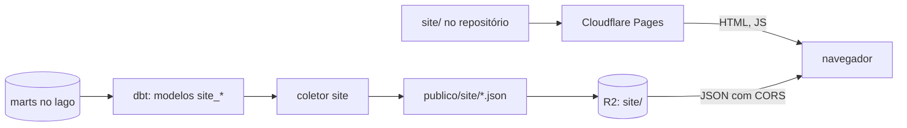

# Site público: design

Data: 2026-10-07
Status: aprovado (com os ajustes do protótipo, seção 11)

## 1. Objetivo

Dar uma interface aos marts publicados no R2: um site em que o cidadão e o jornalista buscam um
parlamentar ou uma empresa pelo nome (ou CNPJ) e veem, em linguagem simples, quanto gastou da cota,
quais emendas destinou, o que a empresa recebeu do governo federal e quais alertas automáticos
apareceram, sempre com a regra explicada e o caminho até a fonte oficial.

### Decisões do usuário

| Tema | Decisão |
|---|---|
| Público | cidadão e jornalista: busca por nome, linguagem simples, link para a fonte oficial |
| Alertas | todos os alertas publicados, com cautela: regra em linguagem simples, aviso de que é indício automático e não acusação, data dos dados e link para a fonte |
| Senadores "só pelo nome" | no alerta de parlamentar sócio de fornecedor, num grupo separado, abaixo dos casos com nome e CPF, com o aviso "correspondência só pelo nome, pode ser homônimo" |
| Hospedagem | Cloudflare Pages, endereço `eleitorado.pages.dev` (domínio próprio depois, só DNS) |
| Dados | índice pré-gerado pelo pipeline (abordagem A): modelos `site_*` no dbt geram JSON em blocos em `site/` no R2; o site estático só lê esses arquivos |
| Visual | `site/DESIGN.md` (tema escuro, quase acromático, controles em pílula), com as adaptações para dados que estão no topo do arquivo |

### Fora do escopo (primeira versão)

- Comparação entre parlamentares, rankings, páginas de órgão e de município.
- TSE (onda C2, ainda não coletada).
- Páginas pré-renderizadas para prévia de link em redes sociais (a primeira versão é SPA).
- Lista de despesas individuais: o site mostra agregados e aponta para a fonte oficial.
- Domínio próprio.

## 2. Arquitetura

- O pipeline diário (`pipeline.yml`) ganha dois passos: os modelos `site_*` entram no `dbt build`
  e o `coletor site` grava os arquivos antes do `coletor publicar`.
- O site (pasta `site/` do repositório) é estático; o Cloudflare Pages o publica a cada push na
  `main`. Ele só muda quando o código muda; os dados se atualizam sozinhos todo dia.
- O contrato entre os dois lados são os JSON Schemas de `site/esquemas/` (seção 4.4).

## 3. Páginas

| Rota | Conteúdo |
|---|---|
| `/` | Caixa de busca única (parlamentar, empresa ou CNPJ) sobre o gradiente da capa; números gerais (total da cota, das emendas pagas e dos contratos; alertas por tipo); 20 alertas mais recentes; data da última atualização. |
| `/parlamentar/<casa>-<id>` | Foto, nome, partido, UF, casa e link para a página oficial. Cota: total por ano (barras), por categoria, 20 maiores fornecedores (link para a empresa quando é CNPJ). Emendas de autoria: pago por ano e 20 maiores favorecidos. Alertas ligados ao parlamentar. |
| `/empresa/<raiz>` | Cadastro na Receita (razão social, situação e desde quando, abertura, porte, atividade, município/UF, Simples/MEI, quantidade de estabelecimentos e de sócios; nunca os sócios). O que recebeu: cota (de quais parlamentares), emendas (de quais autores), contratos federais (de quais órgãos), licitações vencidas. Sanções (CEIS/CNEP, vigentes e encerradas). Alertas. |
| `/alertas` | Lista por tipo (filtro), do mais recente ao mais antigo, paginada; cada item leva ao parlamentar e/ou à empresa. No topo, a explicação em linguagem simples de cada regra. |
| `/sobre` | Fontes e frequência de atualização; como ler um alerta; limitações conhecidas; LGPD; como baixar os dados (link para `docs/modelos-de-dados.md` e para o R2); situação das fontes (`monitor_fontes`) e fontes que encolheram (`alerta_fonte_reduzida`). |
| qualquer outra | 404 com a busca. |

Links oficiais:
- Deputado: `https://www.camara.leg.br/deputados/<id>`.
- Senador: `https://www25.senado.leg.br/web/senadores/senador/-/perfil/<id>`.
- Empresa: busca do Portal da Transparência (`https://portaldatransparencia.gov.br/busca?termo=<cnpj da matriz>`).

Os dois primeiros foram confirmados no protótipo. O Portal recusa clientes que não são navegador (405), então o link da empresa é conferido no navegador durante o plano 11.

## 4. Dados do site

### 4.1 Modelos `site_*`

Pasta nova `dbt/models/site/`, materializada como tabela no DuckDB (não vai para `marts/`). Os
modelos leem só marts e seeds, nunca `intermediate` nem `staging`: o site não pode mostrar nada que
não esteja já publicado.

Cada modelo final tem uma linha por arquivo: `caminho` (relativo a `site/`, ex.:
`parlamentar/camara-204554.json`) e `conteudo` (JSON montado no SQL). Antes do JSON, a agregação
fica em modelos intermediários da própria pasta (tabelas com colunas normais), onde ficam os testes.

| Modelo | Papel |
|---|---|
| `site_alertas` | União dos 9 alertas de fatos (todos menos `alerta_fonte_reduzida`) num formato comum (seção 4.3) |
| `site_parlamentar_agregados` | Cota por ano/categoria/fornecedor, emendas por ano/favorecido, por parlamentar |
| `site_empresa_agregados` | Cota por parlamentar, emendas por autor, contratos por órgão, licitações vencidas, sanções, por raiz |
| `site_arquivos` | Todas as linhas (`caminho`, `conteudo`) dos arquivos da seção 4.2 |

Seed `dbt/seeds/site_alerta_tipos.csv` (`tipo`, `titulo`, `explicacao`, `cautela`, `ordem`): o
texto em linguagem simples de cada tipo de alerta. É a fonte única desses textos; o site os lê do
`resumo.json`. Um teste garante que todo `tipo` em `site_alertas` existe no seed.

Regras de agregação:
- Totais e agregados excluem registros com `valor_suspeito` ou `data_emissao_valida = false`, como
  os alertas (convenção do projeto).
- Cota: por ano de competência; só `tipo_beneficiario = 'parlamentar'`.
- Emendas: valor pago (`fct_emenda_pagamento`, fase `Pagamento`), ligado ao parlamentar por
  `dim_autor_emenda.parlamentar_id`.
- Empresa: o universo é `dim_empresa`. A raiz vem do documento do fato (macros de
  `dbt/macros/documentos.sql`, CNPJ alfanumérico incluído).
- Listas "top": 20 itens, por valor decrescente, com desempate por nome.

### 4.2 Arquivos

Os nomes de arquivo de busca e de empresa levam um prefixo fixo (`p_`, `b_`): `con`, `prn`,
`aux` e `nul` são nomes reservados no Windows (revisão do plano 10).

Todo arquivo tem `"esquema": 1`. Só o `resumo.json` tem `"gerado_em"` (ISO 8601): com a data
em todo arquivo, todos mudariam todo dia e o envio incremental não serviria (protótipo).

| Caminho | Conteúdo | Quantidade estimada |
|---|---|---|
| `resumo.json` | `gerado_em`, `dados_ate` (última data de cada fonte), `totais`, `alerta_tipos` (do seed, com a quantidade de cada um), `alertas_recentes` (20, só correspondência `forte` e data até hoje), `fontes` (`monitor_fontes`), `fontes_reduzidas` (`alerta_fonte_reduzida`) | 1 |
| `busca/parlamentares.json` | `parlamentares`: `id`, `nome`, `casa`, `uf`, `partido`, `foto`, `legislaturas` | 1 |
| `busca/empresas/p_<abc>.json` | `prefixo`, `empresas`: `raiz`, `nome`, `uf`, `situacao` das empresas com alguma palavra da razão social começando por `<abc>` (3 primeiros caracteres, sem acento, minúsculos) | alguns milhares |
| `parlamentar/<casa>-<id>.json` | `parlamentar` (de `dim_parlamentar` + `url_oficial`), `cota` (`total`, `por_ano`, `por_categoria`, `fornecedores`), `emendas` (`total_pago`, `por_ano`, `favorecidos`), `alertas` | ~2.500 |
| `empresa/b_<abc>.json` | `bloco`, `empresas`: objeto por raiz com `cadastro`, `cota`, `emendas`, `contratos`, `licitacoes`, `sancoes`, `alertas`, das raízes que começam por `<abc>` | ~1.000 |
| `alertas/<tipo>/<n>.json` | `tipo`, `pagina`, `paginas`, `total`, `alertas` (500 por página, do mais recente ao mais antigo) | dezenas |

Busca de empresa:
- Palavras ignoradas no índice: `ltda`, `me`, `epp`, `eireli`, `sa`, `s/a`, `cia`, `de`, `da`, `do`, `das`, `dos`, `e`, `comercio`, `servicos`, `industria`.
- Só palavras com 3 caracteres ou mais entram no índice.
- O site baixa o bloco das 3 primeiras letras da primeira palavra digitada (com 3 ou mais caracteres e fora da lista) e filtra no navegador por todas as palavras digitadas (prefixo, sem acento).
- Bloco com mais de 5.000 empresas é subdividido: o arquivo de 3 caracteres traz só `"subdividido": true`, e as empresas vão para blocos de 4 caracteres (`busca/empresas/p_<abcd>.json`); o site então usa as 4 primeiras letras. O arquivo subdividido mantém as empresas com uma palavra de exatamente 3 caracteres; com só 3 letras digitadas, o site mostra essas e pede mais uma letra.
- Consulta com 8 ou 14 caracteres de CNPJ (com ou sem pontuação) vai direto para `/empresa/<raiz>`.

Limites de tamanho (seção 11):
- Nenhum arquivo passa de 2 MB descomprimido nem de 500 KB em gzip.
- Se um parlamentar ou uma empresa tiver alertas demais, o arquivo traz os 200 mais recentes e o `total`; o resto fica em `/alertas`.

### 4.3 Formato comum de alerta

Cada item de `alertas` (em qualquer arquivo):

| Campo | Descrição |
|---|---|
| `alerta_id` | O do mart (estável) |
| `tipo` | Nome do mart sem o prefixo `alerta_` (ex.: `cota_fornecedor_sancionado`) |
| `data` | Data do fato (emissão, documento, assinatura, licitação) |
| `valor` | Valor do fato (R$), quando houver |
| `parlamentar_id`, `parlamentar_nome` | Quando houver (cota, emenda via autor, sócio) |
| `cnpj_raiz`, `empresa_nome` | Quando houver |
| `cnpj_raiz_2`, `empresa_nome_2` | A segunda empresa, só em `licitacao_socios_em_comum` (o alerta aparece no arquivo das duas) |
| `descricao` | Frase curta montada no SQL (ex.: "Despesa de R$ 1.200,00 com EMPRESA X, sancionada no CEIS por Órgão Y desde 2025-03-01") |
| `correspondencia` | `forte` ou `fraca` (`fraca`: senador sócio só pelo nome; correspondência por `cnpj_raiz` em vez do CNPJ completo) |
| `regra` | A coluna `regra` do mart |

### 4.4 Contrato (JSON Schemas)

- `site/esquemas/<tipo de arquivo>.schema.json`, um por linha da tabela 4.2, com
  `additionalProperties: false`.
- Do lado do pipeline, o pytest valida a saída do `coletor site` contra os esquemas.
- Do lado do site, os testes usam exemplos escritos à mão em `site/exemplos/` (o mesmo layout de `site/` do R2), validados pelos mesmos esquemas.
- Mudança de formato:
  - incompatível → sobe `esquema` e muda os dois lados no mesmo PR;
  - compatível (campo novo opcional) → mantém o número.

## 5. Pipeline e publicação

- **`coletor site`:**
  - lê `site_arquivos` do DuckDB e grava cada linha em `<ELEITORADO_PUBLICO>/site/<caminho>`, em UTF-8 comprimido com gzip (`mtime=0`);
  - falha se algum arquivo passar dos limites da seção 4.2, tiver CPF completo em algum texto
    ou não seguir o JSON Schema do seu tipo (todos os arquivos, menos `empresa/` e
    `busca/empresas/`, validados por amostra de 20 de cada, para não pesar no pipeline);
  - grava numa pasta temporária e só troca `site/` no fim: em caso de falha, nada muda;
  - antes, apaga `site/` inteira, para que um arquivo que deixou de existir não fique para trás;
  - recusa caminhos com `..` ou absolutos.
- **`pipeline.yml`:** o `coletor site` roda no passo de publicação, antes do `coletor publicar`.
  Ele mesmo roda os modelos `site_*` e o seed (`dbt build --select path:models/site
  site_alerta_tipos`), que ficam fora do `dbt build` do pipeline (revisão final do plano 10: uma
  falha neles não pode impedir a publicação dos marts). Se ele falhar, os marts são publicados mesmo
  assim e o job fica vermelho; sem `site/` local, o `publicar` não apaga o `site/` do R2, que
  continua com os dados da véspera.
- **`publicacao.py`:**
  - `PERMITIDOS` ganha `site/`;
  - o `manifesto.json` continua listando só `marts/` e `linhagem/`;
  - o envio passa a ser **incremental**: compara o MD5 local com o ETag do objeto no R2 (uploads simples, sem multipart, têm ETag = MD5) e só envia o que mudou. Isso vale para todos os arquivos e evita reenviar milhares de JSON por dia.
  - os envios são simultâneos (16 de cada vez), porque o site tem milhares de arquivos;
  - o cliente do R2 não usa checksum em trailer: com ele, o botocore manda
    `Content-Encoding: gzip,aws-chunked`;
  - arquivos de `site/` saem com `Cache-Control: public, max-age=600`;
  - os JSON de `site/` são gravados já em gzip, de forma determinística (`mtime=0`), e enviados com `Content-Encoding: gzip`. O `r2.dev` não comprime sozinho (verificado), e o navegador descomprime de forma transparente. O ETag é então o MD5 dos bytes comprimidos, que é o que o envio incremental compara.
- **CORS no bucket R2** (configuração única do usuário, no painel da Cloudflare): `GET` e `HEAD` para `https://eleitorado.pages.dev`, `https://*.eleitorado.pages.dev` (prévias) e `http://localhost:5173`.

## 6. Frontend

- **Pasta:** `site/`, com `package.json` próprio (Node 22 LTS, npm).
- **Stack:**
  - Vite + React + TypeScript (estrito) e React Router;
  - Tailwind v4 com os tokens de `site/DESIGN.md`;
  - Observable Plot para os gráficos;
  - fontes DM Sans e Geist via `@fontsource`.
- **Rotas:** SPA; `site/public/_redirects` com `/* /index.html 200`.
- **Endereço dos dados:** `VITE_DADOS_URL`.
  - Padrão: `https://pub-e140b10136c94c9eb7cdb0a31fe603f3.r2.dev/site`.
  - Em desenvolvimento e nos testes: `/exemplos`, que serve `site/exemplos/`.
- **Camada de dados:** um módulo `dados.ts` com uma função por tipo de arquivo. Ele:
  - baixa o arquivo e verifica `esquema === 1`;
  - guarda em memória o que já baixou na sessão.
- **Visual** (`site/DESIGN.md` e as adaptações do topo):
  - âmbar como única cor de alerta;
  - gráficos em cinza com o destaque em branco;
  - contraste AA;
  - navegação flutuante embaixo no celular.
- **Cautela nos alertas:**
  - todo alerta mostra a `descricao`, a explicação do tipo (do seed), o aviso fixo "Indício gerado automaticamente a partir de dados públicos; não é acusação nem constatação de irregularidade", a data dos dados e o link para a fonte;
  - alertas `fraca` aparecem num grupo separado, abaixo, com o aviso específico.
- **Erros e casos de borda:**
  - Falha de rede → "Dados indisponíveis no momento" e botão de tentar de novo.
  - `esquema` diferente → aviso de que o site precisa ser atualizado.
  - Parlamentar ou empresa inexistente → 404 com a busca.
  - `gerado_em` com mais de 3 dias → faixa com a data da última atualização.
- **Acessibilidade:**
  - todo gráfico tem tabela equivalente, acessível por um botão "ver tabela";
  - navegação por teclado e foco visível;
  - `lang="pt-BR"`;
  - números e datas formatados em pt-BR (`Intl`).

## 7. LGPD

- O site só usa marts públicos, que já cumprem as regras do projeto. Os modelos `site_*` não leem
  `intermediate` nem `staging`.
- Todo modelo `site_*` leva os testes `sem_cpf_completo` e `sem_dados_pessoais`. Em
  `site_arquivos`, `conteudo` é VARCHAR (o JSON como texto), para que o `sem_cpf_completo`
  percorra também o JSON; o `sem_dados_pessoais` (que olha os nomes de coluna) vale nos modelos
  de agregados, onde as colunas ainda têm nome.
- **Revisão (plano 10):** o `sem_cpf_completo` no JSON como texto daria falso positivo em valores
  com 11 dígitos na parte inteira (R$ 10 bi a R$ 100 bi, possível em totais de contratos). Por
  isso ele vale nos modelos de colunas (`site_alertas`, `site_cota`, `site_emendas`,
  `site_contratos`), e o `coletor site` procura CPF só nos **textos** de cada JSON, depois de
  lê-lo.
- Sócios aparecem só como contagem (`dim_empresa.socios`); nome e CPF de sócio nunca.
- O site não usa cookies, analytics de terceiros nem fontes externas.

## 8. Testes e CI

- **dbt:**
  - `unique`/`not_null` nas chaves;
  - teste unitário de `site_alertas` com um caso de cada tipo e a correspondência `fraca`;
  - teste unitário dos agregados com um registro `valor_suspeito` ficando de fora;
  - teste do seed de tipos;
  - `sem_cpf_completo` e `sem_dados_pessoais`.
- **pytest:**
  - `coletor site`: grava os arquivos, apaga os antigos e recusa caminho inválido;
  - validação contra os esquemas a partir de um DuckDB de teste;
  - `publicar` incremental: não reenvia quando o ETag bate, reenvia quando muda, e mantém a remoção dos que sumiram;
  - `site/` fora do manifesto.
- **Site** (Vitest + Testing Library):
  - exemplos validados pelos esquemas (com `ajv`);
  - a busca: prefixo, palavras ignoradas, CNPJ com e sem pontuação, alfanumérico;
  - cada página renderiza a partir dos exemplos;
  - os estados de erro e o 404;
  - o aviso de cautela presente em todo alerta.
- **CI:**
  - um job novo, `site`, no `ci.yml`: `npm ci`, lint (ESLint), `tsc --noEmit`, `vitest run` e `vite build`;
  - ações fixadas por SHA;
  - o usuário decide se adiciona o job ao ruleset da `main`.

## 9. Deploy e operação

**Passos do usuário** (configuração única):
1. Criar o projeto `eleitorado` no Cloudflare Pages com integração Git: diretório raiz `site`, comando de build `npm ci && npm run build`, saída `dist`, variável `NODE_VERSION=22`. A produção sai da `main` e cada PR ganha uma prévia. Nenhum token da Cloudflare no GitHub.
2. Configurar a regra de CORS do bucket R2 (seção 5).

**Operação:**
- O tempo do pipeline cresce pelos modelos `site_*` e pelo `coletor site`. O protótipo mede quanto.
- O envio incremental deve deixar o `publicar` mais rápido que hoje.

## 10. Divisão do trabalho

1. **Protótipo** (antes dos planos, nesta máquina):
   - consultas `site_*` em DuckDB lendo os marts públicos direto do R2;
   - mede a quantidade e o tamanho dos arquivos, os blocos da busca e o tempo;
   - confere os links oficiais e o ETag do R2.
   - Ajusta esta spec (seção 11).
2. **Plano 10, dados do site:**
   - esquemas, seed, modelos `site_*`, `coletor site`, `publicar` incremental e `pipeline.yml`;
   - os esquemas e os exemplos saem na primeira tarefa, porque destravam o plano 11.
3. **Plano 11, frontend:**
   - tudo em `site/`, desenvolvido contra `site/exemplos/`;
   - executado por uma sessão do Claude Code na nuvem, com PR e CI verde; o merge é do usuário.

## 11. Protótipo (2026-10-07)

Consultas no formato da seção 4 em DuckDB, sobre os marts públicos baixados do R2 (manifesto de
2026-10-06 21:08 UTC). Os marts da C1 ainda não estavam publicados: as empresas vieram do raw
local da Receita (competência 2026-09, aproximação de `dim_empresa`) e os quatro alertas da C1
ficaram de fora, então os arquivos de empresa vão crescer um pouco.

| Grupo | Arquivos | Total | Mediana | Maior (descomprimido / gzip) |
|---|---|---|---|---|
| `parlamentar/` | 2.495 | 17,7 MB | 4,7 KB | 134 KB / 9 KB |
| `empresa/` (blocos de 3 caracteres da raiz) | 985 | 165,7 MB | 110 KB | 1,04 MB / 117 KB (bloco `113`, 1.268 empresas) |
| `busca/empresas/` (3 caracteres) | 10.403 | 73,7 MB | 0,3 KB | 1,93 MB / 339 KB (`com`, 20.331 empresas) |
| `busca/parlamentares.json` | 1 | 0,44 MB | — | 441 KB / 54 KB |
| `alertas/` (500 por página) | 72 | 20,1 MB | 294 KB | 315 KB / 19 KB |

- **Total:** 13.956 arquivos, 277 MB descomprimidos e 43 MB em gzip. Tudo gerado em 46 s (4 threads, limite de 3 GB).
- **Ajustes que entraram na spec:**
  - JSON em gzip com `Content-Encoding`, porque o `r2.dev` não comprime;
  - `gerado_em` só no `resumo.json`;
  - limites de 2 MB descomprimido e 500 KB em gzip;
  - subdivisão dos blocos de busca com mais de 5.000 empresas (`com`, `pos`, `mun`, `con`, `ass`, `aut`, `pro`, `fun` passam de 10 mil);
  - só palavras com 3 ou mais caracteres no índice.
- **Maior empresa:** 136 KB (MANUPA, 964 alertas antes do corte em 200). Com o corte, nenhuma passa de ~60 KB.
- **ETag do R2 = MD5 do conteúdo:** confirmado no `manifesto.json`.
- **`r2.dev` responde 403 ao `urllib` do Python** sem `User-Agent`. Isso não afeta navegadores, mas scripts e testes de integração precisam enviar um `User-Agent`.
- **`data_emissao_valida`** não existe nos marts publicados em 2026-10-06 (eles são anteriores ao PR #30). Os modelos `site_*` usam a coluna normalmente, porque o lago atual a tem.
- **Links oficiais:** Câmara e Senado responderam 200. O Portal da Transparência responde 405 a clientes que não são navegador, então o link da empresa usa a busca do Portal.

## 12. Riscos

| Risco | Mitigação |
|---|---|
| Alerta lido como acusação | Aviso fixo em todo alerta, regra explicada, correspondência `fraca` separada, sem vermelho |
| Arquivos grandes demais (parlamentar com muitas emendas, empresa grande) | Corte em 200 alertas e listas top 20; limite de 1 MB verificado no protótipo e num teste do `coletor site` |
| Distribuição desigual dos blocos de busca | Palavras ignoradas; o protótipo mede os maiores blocos; se algum passar de 1 MB, usar 4 caracteres para ele |
| `r2.dev` com limite de taxa (endereço de desenvolvimento da Cloudflare) | Aceito na primeira versão; o domínio próprio (com o bucket servido por ele) resolve |
| Esquema divergente entre pipeline e site | JSON Schemas compartilhados, validados nos dois CIs; `esquema` no arquivo |
| SPA sem prévia de link | Aceito; páginas pré-renderizadas ficam para depois |
